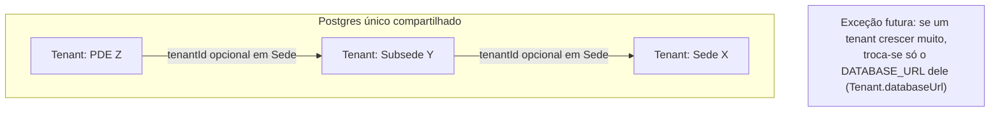
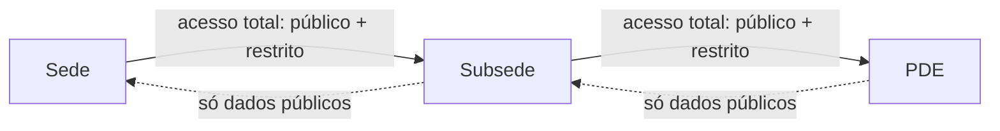
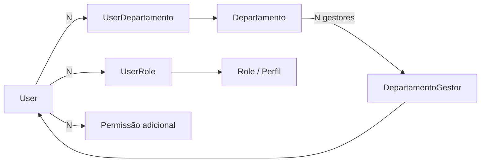
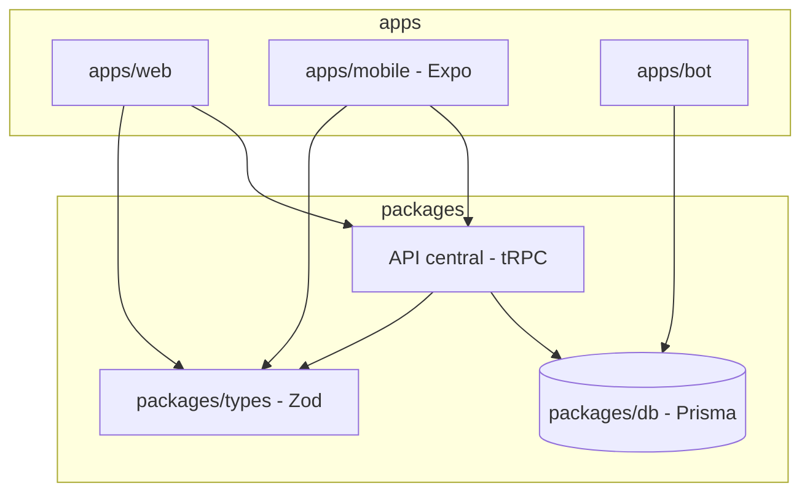

# Arquitetura — Torcida SaaS

> Documento vivo. Atualizar sempre que uma decisão estrutural mudar.
> Última revisão: 2026-07-06

## 1. Visão geral do produto

Plataforma para torcidas organizadas de futebol, com hierarquia de três níveis:

```
Sede (torcida principal)
 └─ Subsede
     └─ PDE (Ponto de Encontro)
```

Modelo de venda é **bottom-up**: qualquer nó pode assinar primeiro (ex: um PDE),
antes da sede-mãe aderir. Quando a sede aderir, os nós filhos se conectam a ela.

Canais do produto:
- **Discord bot** (`apps/bot`) — canal original, ainda em uso ativo.
- **Web** (`apps/web`) — portal (usuário final) + admin (gestão da torcida) + super-admin.
- **Mobile** (planejado) — React Native/Expo, reaproveitando o mesmo backend do web.

---

## 2. Arquitetura atual (as-is)

### 2.1 Repositório

```
botpde/ (monorepo pnpm + turborepo)
├── apps/
│   ├── bot/          Discord bot — JS puro, discord.js, pg direto (sem Prisma)
│   └── web/           Next.js 16 + React 19 — portal, admin, super-admin
└── packages/
    ├── db/            Prisma schema único, compartilhado por quem o importar
    ├── types/          Schemas Zod + permissões compartilhadas
    └── ui/             Componentes React + services (form, dialog, toast...)
```

### 2.2 Dados

- **Um único Postgres compartilhado** (Railway). Multi-tenancy é **lógica**,
  via coluna `tenantId` nas tabelas `saas_*`.
- **Duas gerações de schema coexistindo na mesma base:**
  - Tabelas legadas do bot (`membros`, `produtos`, `pedidos`, `bot_config`...)
    — lidas via `pg` puro pelo bot, e via Prisma (read-oriented) pelo web.
  - Tabelas novas `saas_*` (Tenant, User, Role, Sede, Evento, SaasProduto...)
    — usadas pelo web via Prisma. O bot ainda não escreve nelas.
- `Tenant.databaseUrl` **já tem o mecanismo implementado** —
  `getDbForTenant(tenant)` em `packages/db/src/index.js` retorna um
  `PrismaClient` isolado (com cache por tenant) quando `databaseUrl` está
  preenchido, ou o client compartilhado quando não está. *Correção
  (2026-07-02): revisão anterior deste documento dizia que não havia lógica
  nenhuma — havia, só não é **usada** em nenhuma query do `apps/web` ainda
  (tudo importa `db` direto, não `getDbForTenant`). Ou seja: o mecanismo de
  fuga pra banco dedicado já existe, só falta alguém chamá-lo.*
- Hierarquia de `Sede` já modelada corretamente: auto-relação `sedeId` (pai)
  / `filhos`, e `tenantId` **opcional** — permite um nó existir antes de
  virar tenant (`sedeReferenciaNome` / `sedeReferenciaSlug` guardam a
  referência à sede-mãe ainda não cadastrada).
- Não existe hoje nenhuma regra de **visibilidade cross-tenant** (o que uma
  subsede pode ver da sede, e vice-versa). Cada tenant é uma ilha.
- **Módulo Salas (Meet)**: videoconferência em tempo real dentro de Comunidade,
  via LiveKit/WebRTC — **opcional** (`isLiveKitConfigured()`; sem config, a sala
  ainda funciona como chat/enquetes/presença). Presença e chat/enquetes usam
  polling, não websocket próprio; só áudio/vídeo e o gesto de "levantar a mão"
  usam o data channel do LiveKit. Autorização de host é uma única permissão
  (`meetings:host`); votantes de enquete só são visíveis ao host (privacidade).
  Ver `docs/data/modulo-salas.md`.

### 2.3 Autenticação e autorização

- NextAuth v5 (JWT), providers Discord + Google, unificação de conta por
  e-mail/providerAccountId.
- RBAC por tenant: `Role` (com array de `permissions`), `UserRole`,
  `UserPermission` (overrides pontuais). Tudo escopado por `tenantId` —
  não existe hoje o conceito de papel/permissão que atravesse tenants
  (ex: "admin da sede vê tudo das subsedes").

### 2.4 API / integração mobile

- Não existe uma camada de API formal. O `apps/web` usa Server
  Components/Server Actions do Next.js falando direto com Prisma —
  a única rota de API real é `NextAuth` (`/api/auth/[...nextauth]`).
- **Consequência prática:** hoje não há nada reutilizável para o mobile.
  Qualquer app RN vai precisar de uma API nova, independente do formato
  escolhido (REST, tRPC, etc).
- **Catálogo da superfície de escrita** (as-is) mapeado em
  `docs/api/server-actions.html` — doc navegável (estilo Scalar) de cada
  Server Action: gate de permissão, validação Zod, escritas no banco e
  `AuditLog`. Regenerar quando novas actions forem criadas.
- **Achado de auditoria (2026-07-07, resolvido):** o catálogo expôs que
  `criarTenantInicial` e `atribuirOwnerAction` (super-admin,
  `app/super-admin/setup/actions.ts`) **não gravavam `AuditLog`**, violando a
  convenção "toda mutação administrativa grava AuditLog". Corrigido no mesmo dia
  (`TENANT_CRIADO` / `OWNER_ATRIBUIDO`) — ver §6.

### 2.5 Deploy / custo

- Railway, 4 serviços/projetos:
  - `torcida-web` — Next.js standalone (Nixpacks).
  - `bot-pde` (nome do serviço no Railway: `botpde`) — bot atual (`apps/bot`),
    Root Directory = `apps/bot`, build via `npm install` isolado (não vê o
    resto do monorepo). Funciona bem para o `pg` cru que o bot usa hoje —
    mas **não suporta dependências `workspace:*`** (ver item 4: tentativa de
    usar `@torcida/db` quebrou o deploy, revertida em 2026-07-06).
  - `dbo-bot-pde` — Postgres addon. **Confirmado (2026-07-01) que é o
    mesmo banco usado por `torcida-web`**: `dbo-bot-pde` expõe o host
    interno (`postgres.railway.internal`), `torcida-web` usa o proxy
    público (`*.proxy.rlwy.net`) — mesmas credenciais e mesmo database.
    Não é addon duplicado, sem custo morto aqui.
  - `bot-fivem` — produto anterior/paralelo, ainda ativo, sendo migrado
    aos poucos para o web/mobile atual.
- Hobby Plan: $5/mês incluídos, uso atual ~$2.45/mês estimado — dentro da
  margem, sem necessidade de trocar de provedor no MVP.

---

## 3. Arquitetura alvo (to-be)

### 3.1 Princípio geral

**Isolamento lógico agora, isolamento físico só onde for necessário depois.**
Nada de banco por torcida/subsede/PDE como regra — isso explode custo e
complexidade de query (uma sede consultando 20 PDEs em 20 bancos físicos é
uma operação distribuída cara). O `databaseUrl` no `Tenant` continua
reservado para o caso raro de uma torcida específica crescer sozinha a
ponto de justificar banco dedicado — migração pontual, não arquitetura padrão.



### 3.2 Hierarquia e visibilidade — resolvida por autorização, não por infra

Usar a árvore de `Sede` (já existe) para decidir acesso, com uma
classificação de dado em duas categorias:

- **Público-na-hierarquia**: loja, localização, comunidade/mural, eventos
  públicos — visível para ancestrais E descendentes.
- **Restrito**: membros, sócios, financeiro/pedidos, dados pessoais —
  visível apenas para o próprio tenant **e seus ancestrais** (sede vê tudo
  da subsede/PDE; subsede/PDE não vê o restrito de irmãos ou da sede).



**✅ Implementado (2026-07-03).** Dividido em duas camadas:
- Regra pura em `packages/types/src/visibility.js` — `RECURSO_SENSIBILIDADE`
  (mapa recurso → `publico`/`restrito`) e `resolveVisibility(relation, sensibilidade)`
  / `canViewRecurso(relation, recurso)`, testado isoladamente (self/ancestor
  sempre veem tudo; descendant só vê público; unrelated não vê nada).
- Resolução de hierarquia (precisa de banco) em `apps/web/src/lib/hierarquia.ts`
  — `getTenantRelation(actorTenantId, targetTenantId)` sobe/desce a árvore de
  `Sede` a partir do `tenantId` de cada nó; `resolveVisibility()` (wrapper
  assíncrono) combina os dois; `getTenantHierarquia(tenantId)` monta a sede-mãe
  + lista de descendentes prontos pra exibir.
- Primeira superfície real: `/admin/hierarquia` — mostra a sede-mãe (só dados
  públicos) e as subsedes/PDEs (com métricas restritas — membros ativos,
  sócios — porque olhar descendente é a única direção em que a regra permite
  ver dado restrito). Gate por `SEDES_MANAGE` via `assertPermission`.

### 3.2b Controle de acesso — Departamentos, Perfis e Permissões

> Inspirado em cargos do Discord + revisão de um sistema de controle de
> acesso corporativo de referência (perfis, permissões em árvore,
> concessão/revogação em lote por "contrato"). Decisões fechadas em
> 2026-07-01.

Dois eixos independentes, escopados por tenant (contrato = sede/subsede/pde):

- **Departamento** (`Departamento` model, novo) — agrupamento
  organizacional (Diretoria, Dpto. Financeiro, Sócio, Torcedor...). **Não
  concede permissão nenhuma** — é rótulo/escopo. Lista plana por tenant no
  MVP (sem sub-departamento).
- **Perfil** (`Role`, já existia) — agrupamento de permissões
  (`permissions: String[]`). Quem concede acesso de fato.
- **Permissões adicionais** (`UserPermission`, já existia) — override
  pontual por usuário (`granted: true/false`), além do que os perfis dão.



Um usuário pode estar em vários departamentos e ter vários perfis ao mesmo
tempo (multi-role, já suportado pelo schema via `UserRole` many-to-many).
`packages/types/src/permissions.js` já calcula permissão efetiva como
`perfis ∪ overrides` (`calculateEffectivePermissions`) — praticamente
idêntico ao padrão perfil+permissão-adicional do sistema de referência.

**Gestão delegada de departamento** (`DepartamentoGestor`, novo): quem tem
`ROLES_MANAGE` (dono/admin do tenant) sempre gerencia tudo. Além disso,
qualquer usuário pode ser marcado como gestor de um departamento
específico sem precisar virar admin geral — cobre o caso "presidente da
sede gerencia tudo, liderança de um departamento na subsede/pde gerencia
só aquele departamento". Função helper: `canManageDepartamento()` em
`packages/types/src/permissions.js`.

**Ainda não implementado (próximo passo)**: UI de atribuição de
perfis/departamentos/permissões adicionais por usuário (hoje só existe
CRUD de perfil em `/admin/configuracoes`, sem tela de atribuição —
equivalente à página "Controle de Acesso de Usuário" do sistema de
referência, incluindo fluxo de concessão/revogação em lote).

### 3.3 Unificação bot ↔ web

- Bot para de falar Postgres cru via `pg` e passa a usar `@torcida/db`
  (Prisma), mesmo cliente e mesmo schema que o web.
- Tabelas legadas (`membros`, `produtos`, `pedidos`) migram gradualmente
  para as equivalentes `saas_*`, com script de migração de dados —
  até então seguem lidas em paralelo (como hoje).

**⚠️ Bloqueada por infraestrutura de deploy (2026-07-06)**: implementação
tentada (VIN-11/13/14) e **revertida** — o serviço `botpde` no Railway
builda com Root Directory=`apps/bot` e `npm install` isolado, sem acesso ao
resto do monorepo. `@torcida/db` (`workspace:*`) não resolve nesse contexto
(`npm error Unsupported URL Type "workspace:"`), quebrando 3 deploys
seguidos antes de ser identificado. Retomar só depois de decidir entre:
(a) mudar o Root Directory do `botpde` pra raiz do repo + `pnpm` (igual
`torcida-web` já faz — a correção "de verdade", mas exige mudança no
painel do Railway, possivelmente com "Config-as-code" apontando pro
`apps/bot/nixpacks.toml`/`railway.toml` específico, não testado ainda); ou
(b) vendorizar uma cópia do schema Prisma só pro bot (evita mexer no
Railway, mas reintroduz duplicação de schema — mesma classe de problema
que a remoção do `src/` legado, item 1, resolveu).

### 3.4 Camada de API para mobile

**Prioridade nº 1 é interna, não externa**: a API central existe primeiro
para fazer sede, subsede e PDE trocarem informação entre si (respeitando a
regra de visibilidade da seção 3.2) e para o `apps/mobile` consumir o mesmo
backend que o web. Integração com terceiros **não é objetivo do MVP**.

Formato escolhido: **tRPC**, dentro do monorepo (ex: rotas
`app/api/trpc/[trpc]/route.ts` em `apps/web`, ou pacote `packages/api`),
consumido por `apps/web` e pelo futuro `apps/mobile` (Expo). Motivo:

- Stack já é TypeScript ponta a ponta (Next.js, Prisma, Expo) — tipagem
  end-to-end sem escrever contrato manual.
- Reaproveita os schemas Zod que já existem em `packages/types`, que é
  exatamente o formato de validação que o tRPC espera.
- Não exige servidor/infra separada — roda dentro do `apps/web` atual.



**Fase futura (pós-MVP, fora de escopo agora):** expor uma camada REST fina
por cima do tRPC quando surgir demanda real de integração com terceiros
(ex: outra torcida parceira consumindo dados via webhook, integração de
pagamento externa, parceiros comerciais). Não antecipar isso agora —
adiciona superfície de API pública, versionamento e autenticação de
terceiros que o MVP não precisa.

### 3.5 Deploy / custo

- Manter Railway no MVP (dentro do Hobby Plan).
- Ação imediata: confirmar se `dbo-bot-pde` é o único Postgres em uso
  (comparar `PGHOST` com o que `torcida-web`/`bot-pde` realmente usam) e
  desligar addon duplicado se houver.
- Reavaliar hosting só quando o uso real se aproximar do limite do plano
  (sinal: estimated bill encostando nos $5, ou latência/RAM no limite).

---

## 4. Plano de convergência (as-is → to-be)

| # | Item | Ação | Bloqueia o quê |
|---|------|------|-----------------|
| 1 | ~~`src/` legado na raiz~~ | ✅ Removido em definitivo (2026-07-06, VIN-9), decisão conjunta após análise: confirmado idêntico a `apps/bot/src` (diff vazio), zero configs de build/deploy referenciando o `src/` da raiz (Railway do `bot-pde` roda com Root Directory `apps/bot`), nenhum dos dois tocado desde a migração pro monorepo. Remover não apaga histórico do Git (`git log --all -- src/` continua funcionando). Achado colateral corrigido junto: `apps/bot/src/assets/` estava no `.gitignore`, deixando `pdelogo.png` (usado em runtime por `apps/bot/src/events/ready.js`) sem nenhuma cópia versionada — corrigido antes da remoção (git detectou como rename, preservando o blob) | — |
| 2 | ~~`dbo-bot-pde`~~ | ✅ Confirmado: mesmo banco de `torcida-web`, sem ação necessária | — |
| 3 | ~~Visibilidade cross-tenant~~ | ✅ Feito (2026-07-03): `resolveVisibility`/`canViewRecurso` (`packages/types`) + `getTenantRelation`/`getTenantHierarquia` (`apps/web/src/lib/hierarquia.ts`) + página `/admin/hierarquia` provando o fluxo real | — |
| 22 | ~~Aplicar `resolveVisibility` em mais telas~~ | ✅ Feito (2026-07-05) para comunidade e eventos: `getAncestorTenantIds()` (novo, em `hierarquia.ts`) + `getFeedComunidade()`/`getEscopoEventosVisiveis()` (novos, `apps/web/src/lib/comunidade.ts` e `eventos.ts`) fazem `/portal/comunidade`, `/portal/eventos` e os widgets da Home herdarem conteúdo público de tenants ancestrais. Loja segue pendente | Loja ainda falta |
| 25 | ~~PRD "torcida organizada" — 8 regras de negócio~~ | ✅ Feito (2026-07-05), sem reescrever a arquitetura (decisão de escopo do usuário): (1) `SaasMembro.sedeId` — vínculo territorial explícito, escolhido no cadastro quando o tenant tem mais de uma `Sede`; (2)+(3)+(4) `Announcement`/`AnnouncementRead` (novo, distinto de `Post`) — comunicado oficial com prioridade/pin, gated por nova permissão `announcements:publish` (separada de `community:manage`), sempre ordenado acima do mural local em `getFeedComunidade()`; (5) moderação segue restrita ao próprio tenant (mesmo padrão de `tenantId` nas queries; itens herdados de ancestrais renderizam sem controles de edição); (6) eventos globais vs. restritos a uma unidade via `Evento.sedeId` + `SaasMembro.sedeId`; (7) `EventoRsvp.checkedInAt/checkedInPorId` — check-in real independente do status de RSVP, com botão dedicado em `/admin/eventos/[id]`; (8) `assertMembroAtivo()` (novo, `authz.ts`) bloqueia RSVP de membro pendente/reprovado ou sócio com carteirinha vencida. ⚠️ Nova permissão exige rodar `repair-system-role-permissions.js` depois do `db push` (mesmo padrão do item 18) | — |
| 23 | ~~Bug crítico: `usuarioId` em vez de `atorId` no AuditLog~~ | ✅ Corrigido (2026-07-03): `admin/eventos/actions.ts`, `admin/sedes/actions.ts` e `portal/cadastro/actions.ts` gravavam `auditLog.create({ data: { usuarioId: ... } })`, mas o campo do schema é `atorId`. Sem `try/catch`, isso quebrava em runtime (Prisma "unknown argument") **depois** do registro principal já ter sido salvo — ou seja, criar/editar evento, criar/editar/ativar sede e enviar cadastro de torcedor todos quebravam com erro 500 mesmo tendo escrito o dado. TypeScript não acusava por causa do mesmo teto de inferência descrito na seção 5.2 (o objeto `data` silenciosamente virava `any`) | — |
| 24 | ~~Ciclo na árvore de Sede~~ | ✅ Corrigido (2026-07-03): `editarSede` deixava escolher qualquer sede como pai, inclusive uma descendente da própria sede — isso criaria um ciclo que travaria para sempre `getTenantRelation`/`getTenantHierarquia` (recursão infinita). Adicionado `wouldCreateSedeCycle()` em `apps/web/src/lib/hierarquia.ts`, chamado em `editarSede` antes de gravar; `descendantTenantIds` também ganhou um guard de `visitados` como defesa em profundidade | — |
| 4 | Bot → Prisma | ⚠️ Tentado e **revertido** (2026-07-06): `@torcida/db` (`workspace:*`) quebra o build do serviço `botpde` no Railway (Root Directory=`apps/bot`, `npm install` isolado não resolve o protocolo `workspace:`). Revertido pra `pg` cru (ver seção 3.3). Bloqueado até decidir entre mudar Root Directory pra raiz + `pnpm`, ou vendorizar o schema | Unificação de dados, pré-requisito pra API central completa |
| 5 | Camada de API (tRPC) | Criar `packages/api` (ou rotas tRPC em `apps/web`) focada em uso interno entre hierarquia + mobile | App mobile e troca de dados sede/subsede/PDE |
| 6 | `apps/mobile` | Scaffold Expo, consumindo a API central | Lançamento mobile |
| 7 | API REST pública | **Fora de escopo do MVP** — só entra no roadmap quando houver demanda real de integração com terceiros | Integrações externas (futuro) |
| 8 | ~~Schema Departamento/Perfil~~ | ✅ Feito (2026-07-01): `Departamento`, `UserDepartamento`, `DepartamentoGestor` adicionados ao Prisma schema, `canManageDepartamento()` em `packages/types` | — |
| 9 | ~~UI de atribuição de acesso~~ | ✅ Feito (2026-07-02): `/admin/acessos` — edição por usuário (perfis, departamentos com gestor opcional, permissões efetivas/adicionais). `DepartamentosManager` (CRUD) adicionado em `/admin/configuracoes`. Ver nota de escopo abaixo | — |
| 10 | ~~Migração de banco~~ | ✅ Aplicada (2026-07-02) via `prisma db push` em produção: `saas_departamentos`, `saas_user_departamentos`, `saas_departamento_gestores` e todos os índices novos criados | — |
| 11 | ~~Coerência do schema~~ | ✅ Feito (2026-07-02): `Advertencia` sem relação de `Tenant` corrigido; índices adicionados em toda coluna `tenantId`/FK usada em query multi-tenant (`Sede`, `Evento`, `SaasProduto`, `SaasPedido`, `Post`, `AuditLog`, `UserRole`, `UserPermission`, `UserDepartamento`, `DepartamentoGestor`) | — |
| 12 | ~~Permissão desde o primeiro acesso~~ | ✅ Feito (2026-07-02): aprovar `SaasMembro` agora auto-concede Role `member` + Departamento (Sócio/Torcedor) via `concederAcessoBasico()` em `admin/membros/actions.ts` | — |
| 13 | ~~Menu do admin gated por permissão~~ | ✅ Feito (2026-07-02): `ADMIN_MENU` + `filterMenuByPermissions`/`hasAdminAreaAccess` em `packages/types/src/menu.js`; `admin/layout.tsx` e `AdminSidebar` agora filtram por permissão efetiva em vez de nome de cargo hard-coded | — |
| 14 | ~~Cargos de sistema desalinhados~~ | ✅ Corrigido (2026-07-02): seed de `owner`/`admin`/`member` em `super-admin/setup/actions.ts` usava strings em português (`membros:ler`, `sedes:editar`...) divergentes do vocabulário canônico (`members:view`, `sedes:manage`...) usado pela UI de cargos e por `packages/types`. Agora usa `SYSTEM_ROLES`/`SYSTEM_ROLE_PERMISSIONS` compartilhados | ⚠️ ver nota de migração abaixo |
| 17 | ~~Gestão de perfis aprimorada~~ | ✅ Feito (2026-07-02), inspirado na tela de Perfis/Permissões de referência: cascata de dependência (`applyPermissionCascade` em `packages/types` — marcar permissão não-base puxa a base do grupo, ex. `members:view`; desmarcar a base derruba as irmãs), aplicada na UI E no servidor (cargos e acessos); diff visual verde/vermelho com contadores por grupo na edição; busca por nome/permissão; confirmação com resumo das mudanças; exclusão bloqueada para cargo em uso (contagem exibida); validação de ≥1 permissão | — |
| 15 | ~~Reparo de dados em produção~~ | ✅ Rodado (2026-07-02) via `packages/db/scripts/repair-system-role-permissions.js`: 0 correções necessárias — o único tenant existente (`pde-gavioes-fiel`) já tinha as 3 roles de sistema com permissões canônicas (foi criado via `prisma/seed.js`, que nunca teve o bug — só o wizard `super-admin/setup` tinha). Script fica registrado (`pnpm --filter @torcida/db db:repair-system-roles`) como rede de segurança idempotente para o futuro | — |
| 18 | ~~Sistema de comunidade~~ | ✅ Feito (2026-07-02): `/admin/comunidade` (CRUD de posts, fixar/desafixar, gate por `COMMUNITY_MANAGE`) + `/portal/comunidade` (feed somente-leitura, fixados primeiro). Usa o model `Post` que já existia no schema (nunca tinha UI). Nova permissão `community:manage` exigiu rodar `repair-system-role-permissions.js` de novo — owner/admin em produção ganharam a permissão retroativamente | — |
| 19 | Sistema de comunidade — sem interação | Hoje é só mural de avisos (admin publica, membro lê). Sem comentários/reações — schema `Post` não tem essas tabelas. Adicionar se virar demanda real | Engajamento social (futuro) |
| 20 | ~~`packages/ui` — design system real~~ | ✅ Feito (2026-07-02): extraídos `FieldError`, `Input`/`Select`/`Textarea`, `SubmitButton`, `Badge`, `PageHeader`, `Card` — eram copiados byte-a-byte em 6+ arquivos (`evento-forms`, `post-forms`, `sede-forms`, `cadastro-form`, `perfil-form`, parcialmente `produto-forms`). Build real com `tsup` (`dist/` com `.js`/`.mjs`/`.d.ts`), sem alterar como `apps/web` consome o pacote hoje (`exports` continua apontando pro `src`, o build é uso externo/futuro). Motivação: preparar pra sincronizar com claude.ai/design (`/design-sync`) depois — hoje não havia nada buildável pra sincronizar | — |
| 21 | Migrar admin/loja para os componentes do design system | `produto-forms.tsx` tem estilo de input divergente (sem focus ring, padding menor) — não migrado agora pra não arriscar regressão visual sem visualizar. Unificar quando alguém revisar a tela da loja | Consistência visual completa |
| 26 | ~~Roteamento por subdomínio real~~ | ✅ Preparado (2026-07-05): `ROOT_DOMAIN` validada em `apps/web/src/lib/env.ts`, `tenant.ts` já usava a lógica certa (só faltava a env var validada). Testável agora **sem domínio próprio** via `ROOT_DOMAIN=lvh.me` (`*.lvh.me` resolve pra `127.0.0.1`, sem DNS). `auth.ts` ganhou cookie de sessão compartilhado entre subdomínios (`cookies.sessionToken.domain = .${ROOT_DOMAIN}`) — sem isso, logar em `sede.lvh.me` não mantinha sessão em `subsede.lvh.me`. Script `promover-subsede-para-tenant.js` promove uma `Sede` de teste a `Tenant` de verdade, reaproveitando o mesmo usuário owner | Só falta domínio real — ver nota de produção abaixo |
| 27 | ~~Segundo método de login (e-mail/senha)~~ | ✅ Feito (2026-07-05): `User.senhaHash` (nullable, só contas com senha têm), provider `Credentials` em `auth.ts` (bcrypt.compare, erro genérico — não diferencia e-mail inexistente de senha errada), `/entrar/criar-conta` (cadastro) e formulário de senha em `/entrar`. Callback `jwt` ganhou ramo específico pra `account.provider === 'credentials'` (usa `user.id` direto, os ramos de discordId/googleId não se aplicam). **Decisão deliberada**: conta com senha NÃO mescla com conta OAuth existente do mesmo e-mail (evita takeover) | Reset de senha (item 28) |
| 28 | "Esqueci minha senha" | Fora de escopo por decisão do usuário — exige provedor de e-mail transacional (nenhum configurado no projeto ainda, ex: Resend). Enquanto não existir, reset é manual (direto no banco) | Fluxo de recuperação completo |
| 29 | ~~Rate-limit de login~~ | ✅ Feito (2026-07-06): `apps/web/src/lib/rate-limit.ts` (in-memory, sem Redis/Upstash — 5 tentativas/15min por e-mail, aceitável no estágio atual de baixo tráfego e única instância). Já existia desde antes desta revisão, mas só era chamado na Server Action de `/entrar` — uma chamada direta a `/api/auth/callback/credentials` (pulando a UI) contornava o limite. Corrigido movendo a aplicação real (`excedeuLimite`/`registrarTentativaFalha`) para dentro do `authorize()` do provider Credentials em `lib/auth.ts`, o único ponto por onde toda tentativa de login passa de fato. Server Action mantém só a checagem rápida (evita round-trip) | Reavaliar store compartilhado (Redis/Upstash) antes de escalar para múltiplas instâncias |

## 5. Decisões fechadas nesta revisão

- API central = **tRPC**, com foco inicial em uso **interno** (hierarquia
  sede/subsede/PDE + mobile). REST para terceiros fica documentado como
  fase futura, não meta do MVP.
- `dbo-bot-pde` confirmado como o mesmo Postgres do `torcida-web` — sem
  banco duplicado, sem ação de custo pendente.
- Aprovação de `SaasMembro` concede automaticamente Role `member` +
  Departamento padrão (Sócio/Torcedor); atribuições extras continuam manuais.
- Árvore de menu do admin fica **estática no código** (`packages/types`),
  não configurável via banco no MVP.
- Permissões efetivas são resolvidas **no servidor a cada request**
  (já era o comportamento de `getUserPermissionsInTenant`), não embutidas
  no JWT — evita permissão desatualizada sem novo login.

### 5.1 UI de atribuição de acesso (item 9) — o que entrou e o que ficou de fora

- `/admin/acessos`: lista os usuários do tenant (qualquer um com `SaasMembro`,
  `UserRole`, `UserDepartamento` ou `UserPermission` no tenant atual) e permite
  editar, por usuário: perfis (multi-select), departamentos (multi-select,
  com checkbox "gestor" por departamento selecionado) e **permissões
  efetivas** — uma lista única de checkboxes que representa o resultado
  final desejado (vem do perfil OU é concessão/revogação pontual); o server
  action (`salvarAcessoUsuario`) calcula o diff mínimo contra o estado atual
  e só grava overrides em `UserPermission` quando o efetivo desejado diverge
  do que o(s) perfil(is) já dariam — implementa exatamente a semântica de
  `calculateEffectivePermissions` (perfil ∪ overrides) de trás pra frente.
- Gate de acesso por **permissão granular** (`ROLES_MANAGE`) via helper
  `assertPermission()` em `apps/web/src/lib/authz.ts` — não por nome de
  cargo. **Atualização (2026-07-06, item 16): esse critério agora é o único
  em todo o admin** — ver seção 5.3.
- Também extraído: `assertAdmin`/`assertOwner` estavam duplicados em 2
  arquivos (`membros/actions.ts`, `configuracoes/actions.ts`) — agora vivem
  só em `apps/web/src/lib/authz.ts`. `PERMISSION_GROUPS` (labels de UI por
  permissão) também deixou de estar hard-coded em `config-forms.tsx` e virou
  export de `packages/types`.
- **Fora do escopo desta rodada** (fast-follow se precisar): grant/revoke em
  lote pra múltiplos usuários ao mesmo tempo (o v1 edita um usuário por vez).

### 5.2 Achado técnico: anotação explícita de tipo é obrigatória em queries novas do Prisma

Ao escrever `/admin/acessos`, `db.role.findMany(...).map(...)` (e padrões
equivalentes) passaram a falhar com `implicit any`/`unknown` no `tsc`, **sem
nenhum erro no arquivo que gerou o dado** — só nos usos seguintes. Isolado e
confirmado: é um teto de profundidade de inferência do TypeScript contra os
tipos condicionais gerados pelo Prisma para este schema (43 models bem
relacionados, contagem em 2026-07-08) — a inferência automática do retorno de `findMany`/`findUnique`
simplesmente para de funcionar de forma **silenciosa** a partir de um certo
ponto, sem "excessively deep" explícito.

**Regra a partir de agora**: sempre anotar explicitamente o tipo do retorno
de queries Prisma novas (`const x: MinhaInterfaceLite[] = await db.modelo.findMany(...)`),
em vez de depender de inferência automática — isso faz o TypeScript checar
assinalabilidade (mais raso) em vez de re-inferir o tipo completo (mais
profundo). Ver `apps/web/src/app/admin/acessos/actions.ts` e `page.tsx` para
o padrão (`RoleLite`, `DepartamentoLite` etc.).

### 5.3 Item 16 resolvido — assertPermission é o único critério de autorização do admin

`assertAdmin`/`assertOwner` (nome de cargo de sistema `owner`/`admin`) foram
removidos de `apps/web/src/lib/authz.ts` — não têm mais nenhum caller.
Substituídos por `assertPermission(PERMISSION)` em todo `apps/web/src/app/admin/**`:

- `sedes/actions.ts` → `SEDES_MANAGE`
- `loja/actions.ts` → `STORE_MANAGE` (produtos e status de pedido)
- `eventos/actions.ts` → `EVENTS_CREATE` (criar) / `EVENTS_MANAGE` (editar,
  check-in, excluir)
- `membros/actions.ts` → `MEMBERS_APPROVE` (aprovar/reverter) /
  `MEMBERS_REJECT` (reprovar)
- `socios/actions.ts` → `MEMBERS_APPROVE` (emitir/renovar/revogar
  carteirinha — não existe permissão dedicada a "sócio"; reaproveita a mais
  próxima do fluxo de aprovação de associado, decisão a revisitar se virar
  demanda)
- `configuracoes/actions.ts` → `SETTINGS_MANAGE` (perfil do tenant, Discord
  guild — únicas ações que eram `assertOwner`, e `SETTINGS_MANAGE` já é
  exclusiva do owner via `SYSTEM_ROLE_PERMISSIONS`) / `ROLES_MANAGE` (cargos
  e departamentos, mesmo critério já usado em `/admin/acessos`)

Sem regressão para `owner`/`admin` (ambos já têm todas as permissões
granulares via `SYSTEM_ROLE_PERMISSIONS`); um perfil customizado com a
permissão certa passa a acessar a ação equivalente sem precisar do cargo de
sistema. `AuthzResult` (tipo de retorno de `assertPermission`) parou de
derivar de `assertAdmin` (removido) e passou a usar o tipo `Session` de
`next-auth` diretamente — `ReturnType<typeof auth>` não funciona aqui porque
o `auth` do NextAuth v5 é uma função com múltiplos overloads (middleware e
sessão) e a utility type resolve para a assinatura errada.

Testes: `pnpm --filter @torcida/web test` (suíte da VIN-6) continuam verdes,
já que não tocam em `packages/types`. Nenhum teste cobre `assertPermission`
em si (depende de sessão/banco) — cobertura por typecheck + smoke manual.

### 5.4 Provedor de banco — Railway mantido; Prisma Postgres NÃO adotado (2026-07-07)

Decisão de arquitetura de infra, avaliada com prioridade em custo baixo/zero,
simplicidade e baixo risco. **Banco ativo continua o Railway Postgres**
(`dbo-bot-pde`, ver §2.5). O **Prisma Postgres** que aparece no console
`console.prisma.io` **existe mas NÃO é o banco da aplicação** — é uma instância
separada e vazia (mostra "connect your database to start seeing usage").
Prisma é usado apenas como **ORM**, apontando para o Railway via `DATABASE_URL`
(`packages/db/.env`). Não confundir os dois.

Por que manter Railway (sem migrar):
- Já está em produção, funcionando, e co-hospeda `web` + `bot` + Postgres no
  mesmo provedor — menos superfície operacional.
- Custo já baixo (~$2.45/mês dentro do Hobby de $5) — a economia do free tier
  do Prisma Postgres seria marginal e só sobre o DB (o resto segue no Railway).
- **Fator decisivo:** o `bot` acessa o banco com `pg` cru, não Prisma. Prisma
  Postgres é pensado para acesso via Accelerate (pooler/proxy). Migrar exigiria
  retrabalhar o acesso do bot — custo/risco reais por ganho pequeno.
- Conexão TCP direta combina com a arquitetura atual (Next server + bot
  long-running), não serverless.

Quando Prisma Postgres faria sentido no futuro (só neste combo, não antes):
mover o deploy para **serverless/edge** (ex.: Vercel) **e** aposentar o acesso
`pg` cru do bot, indo 100% Prisma — aí o pooling do Accelerate resolve
esgotamento de conexão em serverless e o free tier passa a valer. `Tenant.databaseUrl`
(§3.1) segue reservado para isolamento físico pontual, independente do provedor.

Melhorias ortogonais ao provedor (não são migração): confirmar backups
automáticos do Railway ligados; considerar migrations versionadas para produção
quando o schema estabilizar (hoje o fluxo é `db push`, sem migrations).

### 5.5 Captura visual de fluxo para revisão de UI/UX — Playwright, sem MCP dedicado (2026-07-08)

Adicionado `apps/web/e2e/` (Playwright) para navegar os fluxos principais e
salvar PNGs em `apps/web/e2e/screenshots/<fluxo>/` (não commitado — artefato
local). Objetivo: alimentar o agente `ux-review` (que aciona o skill
`impeccable`) com evidência real de tela em vez de inferência por JSX. Ver
`apps/web/e2e/README.md`.

Por que Playwright (test suite) e não um MCP de browser dedicado:
- O pedido é **repetível e versionável** ("rodar e salvar imagem de cada
  fluxo"), não exploração ad-hoc de uma sessão — isso pede uma suíte de teste,
  não uma ferramenta MCP conversacional.
- O repo já usa Vitest como padrão de teste; Playwright é o par natural para
  e2e/visual, sem introduzir um novo protocolo de integração.
- Login é OAuth (Discord/Google) + e-mail/senha — sem credencial de teste
  seedada. Em vez de automatizar OAuth em CI (frágil), a suíte reusa uma
  `storageState` capturada uma vez manualmente (`test:e2e:login`), padrão
  recomendado do próprio Playwright para apps com OAuth.
- Continua valendo usar `claude-in-chrome`/preview tools para exploração pontual
  interativa; a suíte Playwright é para captura em lote, comparável entre
  execuções.

## 6. Itens em aberto (aguardando decisão)

- ~~**Item 16**~~ — ✅ Resolvido (2026-07-06): ver seção 5.3.
- ~~**Auditoria de ações de super-admin (prioridade de segurança, 2026-07-07)**~~
  — ✅ Feito (2026-07-07): `criarTenantInicial` e `atribuirOwnerAction` agora
  gravam `AuditLog` (sem mudança de schema). Em `criarTenantInicial`, dentro da
  transação (client `tx`): `TENANT_CRIADO` (entidade `Tenant`, `entidadeId:
  t.id`, `detalhes: { slug, nome }`) e `OWNER_ATRIBUIDO` (entidade `User`,
  `entidadeId: session.user.id`). Em `atribuirOwnerAction`, `OWNER_ATRIBUIDO`
  gravado apenas quando o owner é de fato atribuído (dentro do `if (!jaOwner)`),
  para não poluir chamadas idempotentes; `detalhes` inclui `rolesCriadas` quando
  houve criação de cargos de sistema. Nomes seguem o padrão existente
  (`TENANT_PERFIL_ATUALIZADO`, `ROLE_CRIADO`).
- Próximo passo natural de feature: detalhar `resolveVisibility` (item 3) —
  visibilidade cross-tenant na hierarquia sede/subsede/PDE.
- **Item 26 — checklist pra quando houver domínio próprio de produção**
  (usuário ainda não comprou um):
  1. Definir `ROOT_DOMAIN=seudominio.com` nas env vars do serviço
     `torcida-web` no Railway.
  2. Configurar DNS wildcard (`*.seudominio.com` → apontar pro Railway,
     conforme instrução exibida ao adicionar Custom Domain na aba do
     serviço).
  3. Adicionar o domínio wildcard nas configurações de Custom Domain do
     Railway (o certificado SSL costuma ser provisionado automaticamente,
     confirmar na hora — pode exigir plano pago dependendo do momento).
  4. Registrar as novas redirect URIs de produção (`https://<qualquer
     subdomínio>.seudominio.com/api/auth/callback/discord` e `.../google`)
     nos consoles de desenvolvedor do Discord e do Google — OAuth exige URI
     exata, não aceita wildcard; se o login sempre passar pelo domínio raiz
     antes de redirecionar (cookie compartilhado já cobre isso), só a URI do
     domínio raiz precisa estar cadastrada.
- ~~**Comunidade — redesenho UI/UX (rede social)**~~ — ✅ Feito (2026-07-08):
  `/portal/comunidade` reconstruída como hub social de 3 zonas (trilha de
  identidade+navegação, feed central, trilha de notícias+sugestões), com "Ao vivo
  agora" trazendo as salas ativas ao topo, composer convidativo, comunicados
  integrados ao fluxo e cards de post no padrão rede social. Engajamento deixou de
  usar `window.prompt/alert`: `PostEngagement` agora tem contadores reais, reação
  otimista e comentário inline. `feed.ts` passou a projetar `totalReacoes`,
  `totalComentarios` e `minhaReacao` (helpers `postInclude`/`projetarPost`
  exportados; sem mudança de schema). Novos: `components/portal/avatar.tsx`,
  `formatRelative` em `lib/format-datetime.ts`. Salas/Perfil/Solicitações
  alinhados ao mesmo visual. `marcarComunicadosLidos` no feed virou best-effort
  (try/catch) para não derrubar a página.
- **Item 27 — Mensageria da comunidade (plano fechado 2026-07-08, M1 em implementação).**
  Visão do usuário para "conversar/criar comunidades", que o redesenho acima
  ainda NÃO cobre. Decisões fechadas com o usuário (2026-07-08):
  - **Tempo-real: polling** (~2s, mesmo padrão do `SalaChat` das salas de
    vídeo) — zero infra nova; evoluir p/ SSE/serviço só com demanda real.
  - **Alcance de DM: mesmo tenant + aliados** (`self/ancestor/descendant/allied`
    via `canFollowUser`/visibilidade; `unrelated` bloqueado).
  - **Recorte M1: DM 1×1 + Grupos juntos**; Comunidades temáticas ficam p/ M3.
  Modelo de dados (novo domínio, aditivo — NÃO reusa `Post`/`Comentario`):
  `Conversa` (tipo `DIRETA|GRUPO`, tenantId de contexto, nome/descricao/avatar
  p/ grupo, `atualizadoEm` bumpado a cada mensagem p/ ordenar inbox),
  `MembroConversa` (papel `ADMIN|MEMBRO`, `ultimaLeituraEm` p/ não-lidas,
  silenciada, saiuEm), `MensagemDireta` (conteudo, `midiaUrls[]` reusando o
  pipeline Cloudinary/embeds/stickers, respostaA, editadaEm, removidaEm),
  `Bloqueio` (bloqueador/bloqueado) e `DenunciaMensagem` (a `Denuncia`
  existente é acoplada a Post). **Leitura chaveada por participação**
  (`MembroConversa`), não por tenantId — é o que permite DM cross-tenant com
  aliado; `tenantId` na Conversa é contexto/auditoria.
  Permissões novas: `MESSAGES_SEND` + `GROUPS_CREATE` (cargo `member`),
  `MESSAGES_MODERATE` (moderação) — exige rodar
  `repair-system-role-permissions` em produção (mesmo caso do
  `community:manage`, item 18). O chat ao vivo das salas (`SalaChat`/
  `MensagemReuniao`) permanece separado — efêmero, dentro da sala.
  Superfícies M1: `/portal/mensagens` (inbox + thread, composer rico
  reusado), badge de não-lidas na navbar, botão "Mensagem" no perfil.
  M2/M3 (fases seguintes): transferência de admin de grupo, Comunidades
  temáticas (canais de admin, visibilidade pública/aliada) e busca.
