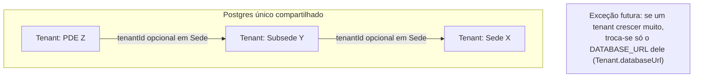
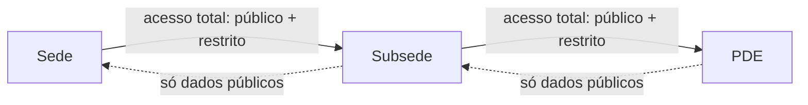
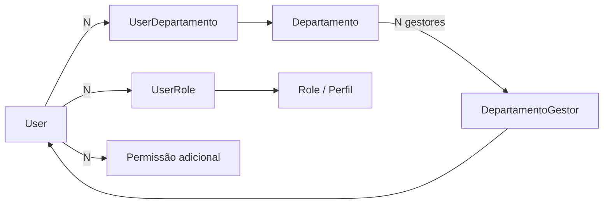
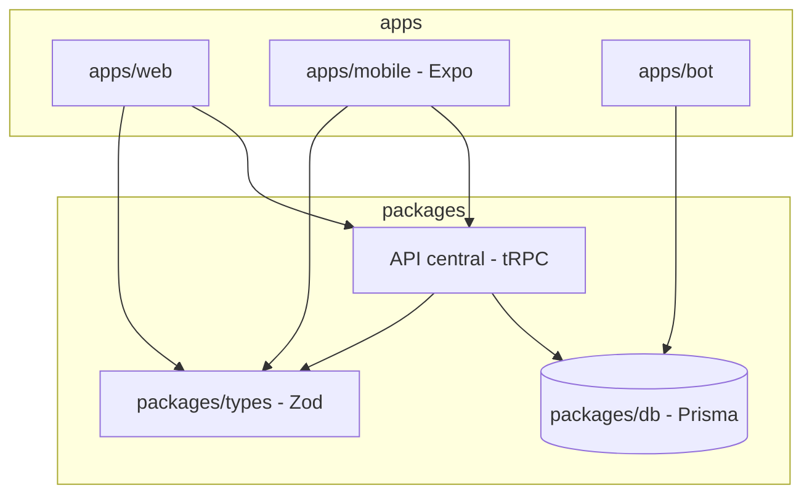

# Arquitetura — Torcida SaaS

> Documento vivo. Atualizar sempre que uma decisão estrutural mudar.
> Última revisão: 2026-07-02

## 1. Visão geral do produto

Plataforma para torcidas organizadas de futebol, com hierarquia de três níveis:

```
Sede (torcida principal)
 └─ Subsede
     └─ PDE (Ponto de Encontro)
```

Modelo de venda é **bottom-up**: qualquer nó pode assinar primeiro (ex: um PDE),
antes da sede-mãe aderir. Quando a sede aderir, os nós filhos se conectam a ela.

Canais do produto:
- **Discord bot** (`apps/bot`) — canal original, ainda em uso ativo.
- **Web** (`apps/web`) — portal (usuário final) + admin (gestão da torcida) + super-admin.
- **Mobile** (planejado) — React Native/Expo, reaproveitando o mesmo backend do web.

---

## 2. Arquitetura atual (as-is)

### 2.1 Repositório

```
botpde/ (monorepo pnpm + turborepo)
├── apps/
│   ├── bot/          Discord bot — JS puro, discord.js, pg direto (sem Prisma)
│   └── web/           Next.js 16 + React 19 — portal, admin, super-admin
├── packages/
│   ├── db/            Prisma schema único, compartilhado por quem o importar
│   ├── types/          Schemas Zod + permissões compartilhadas
│   └── ui/             Componentes React + services (form, dialog, toast...)
└── src/                ⚠️ LEGADO — código do bot pré-monorepo, idêntico
                         a apps/bot/src (confirmado via git diff). Não é usado
                         em produção (Railway aponta pra apps/bot). Candidato
                         a remoção.
```

### 2.2 Dados

- **Um único Postgres compartilhado** (Railway). Multi-tenancy é **lógica**,
  via coluna `tenantId` nas tabelas `saas_*`.
- **Duas gerações de schema coexistindo na mesma base:**
  - Tabelas legadas do bot (`membros`, `produtos`, `pedidos`, `bot_config`...)
    — lidas via `pg` puro pelo bot, e via Prisma (read-oriented) pelo web.
  - Tabelas novas `saas_*` (Tenant, User, Role, Sede, Evento, SaasProduto...)
    — usadas pelo web via Prisma. O bot ainda não escreve nelas.
- `Tenant.databaseUrl` **já tem o mecanismo implementado** —
  `getDbForTenant(tenant)` em `packages/db/src/index.js` retorna um
  `PrismaClient` isolado (com cache por tenant) quando `databaseUrl` está
  preenchido, ou o client compartilhado quando não está. *Correção
  (2026-07-02): revisão anterior deste documento dizia que não havia lógica
  nenhuma — havia, só não é **usada** em nenhuma query do `apps/web` ainda
  (tudo importa `db` direto, não `getDbForTenant`). Ou seja: o mecanismo de
  fuga pra banco dedicado já existe, só falta alguém chamá-lo.*
- Hierarquia de `Sede` já modelada corretamente: auto-relação `sedeId` (pai)
  / `filhos`, e `tenantId` **opcional** — permite um nó existir antes de
  virar tenant (`sedeReferenciaNome` / `sedeReferenciaSlug` guardam a
  referência à sede-mãe ainda não cadastrada).
- Não existe hoje nenhuma regra de **visibilidade cross-tenant** (o que uma
  subsede pode ver da sede, e vice-versa). Cada tenant é uma ilha.

### 2.3 Autenticação e autorização

- NextAuth v5 (JWT), providers Discord + Google, unificação de conta por
  e-mail/providerAccountId.
- RBAC por tenant: `Role` (com array de `permissions`), `UserRole`,
  `UserPermission` (overrides pontuais). Tudo escopado por `tenantId` —
  não existe hoje o conceito de papel/permissão que atravesse tenants
  (ex: "admin da sede vê tudo das subsedes").

### 2.4 API / integração mobile

- Não existe uma camada de API formal. O `apps/web` usa Server
  Components/Server Actions do Next.js falando direto com Prisma —
  a única rota de API real é `NextAuth` (`/api/auth/[...nextauth]`).
- **Consequência prática:** hoje não há nada reutilizável para o mobile.
  Qualquer app RN vai precisar de uma API nova, independente do formato
  escolhido (REST, tRPC, etc).

### 2.5 Deploy / custo

- Railway, 4 serviços/projetos:
  - `torcida-web` — Next.js standalone (Nixpacks).
  - `bot-pde` — bot atual (`apps/bot`), Root Directory configurado corretamente.
  - `dbo-bot-pde` — Postgres addon. **Confirmado (2026-07-01) que é o
    mesmo banco usado por `torcida-web`**: `dbo-bot-pde` expõe o host
    interno (`postgres.railway.internal`), `torcida-web` usa o proxy
    público (`*.proxy.rlwy.net`) — mesmas credenciais e mesmo database.
    Não é addon duplicado, sem custo morto aqui.
  - `bot-fivem` — produto anterior/paralelo, ainda ativo, sendo migrado
    aos poucos para o web/mobile atual.
- Hobby Plan: $5/mês incluídos, uso atual ~$2.45/mês estimado — dentro da
  margem, sem necessidade de trocar de provedor no MVP.

---

## 3. Arquitetura alvo (to-be)

### 3.1 Princípio geral

**Isolamento lógico agora, isolamento físico só onde for necessário depois.**
Nada de banco por torcida/subsede/PDE como regra — isso explode custo e
complexidade de query (uma sede consultando 20 PDEs em 20 bancos físicos é
uma operação distribuída cara). O `databaseUrl` no `Tenant` continua
reservado para o caso raro de uma torcida específica crescer sozinha a
ponto de justificar banco dedicado — migração pontual, não arquitetura padrão.



### 3.2 Hierarquia e visibilidade — resolvida por autorização, não por infra

Usar a árvore de `Sede` (já existe) para decidir acesso, com uma
classificação de dado em duas categorias:

- **Público-na-hierarquia**: loja, localização, comunidade/mural, eventos
  públicos — visível para ancestrais E descendentes.
- **Restrito**: membros, sócios, financeiro/pedidos, dados pessoais —
  visível apenas para o próprio tenant **e seus ancestrais** (sede vê tudo
  da subsede/PDE; subsede/PDE não vê o restrito de irmãos ou da sede).



Implementação sugerida: uma função central `resolveVisibility(actorTenantId, targetTenantId, field)`
que percorre a árvore de `Sede` vinculada a cada tenant — em vez de
espalhar essa lógica em cada query.

### 3.2b Controle de acesso — Departamentos, Perfis e Permissões

> Inspirado em cargos do Discord + revisão de um sistema de controle de
> acesso corporativo de referência (perfis, permissões em árvore,
> concessão/revogação em lote por "contrato"). Decisões fechadas em
> 2026-07-01.

Dois eixos independentes, escopados por tenant (contrato = sede/subsede/pde):

- **Departamento** (`Departamento` model, novo) — agrupamento
  organizacional (Diretoria, Dpto. Financeiro, Sócio, Torcedor...). **Não
  concede permissão nenhuma** — é rótulo/escopo. Lista plana por tenant no
  MVP (sem sub-departamento).
- **Perfil** (`Role`, já existia) — agrupamento de permissões
  (`permissions: String[]`). Quem concede acesso de fato.
- **Permissões adicionais** (`UserPermission`, já existia) — override
  pontual por usuário (`granted: true/false`), além do que os perfis dão.



Um usuário pode estar em vários departamentos e ter vários perfis ao mesmo
tempo (multi-role, já suportado pelo schema via `UserRole` many-to-many).
`packages/types/src/permissions.js` já calcula permissão efetiva como
`perfis ∪ overrides` (`calculateEffectivePermissions`) — praticamente
idêntico ao padrão perfil+permissão-adicional do sistema de referência.

**Gestão delegada de departamento** (`DepartamentoGestor`, novo): quem tem
`ROLES_MANAGE` (dono/admin do tenant) sempre gerencia tudo. Além disso,
qualquer usuário pode ser marcado como gestor de um departamento
específico sem precisar virar admin geral — cobre o caso "presidente da
sede gerencia tudo, liderança de um departamento na subsede/pde gerencia
só aquele departamento". Função helper: `canManageDepartamento()` em
`packages/types/src/permissions.js`.

**Ainda não implementado (próximo passo)**: UI de atribuição de
perfis/departamentos/permissões adicionais por usuário (hoje só existe
CRUD de perfil em `/admin/configuracoes`, sem tela de atribuição —
equivalente à página "Controle de Acesso de Usuário" do sistema de
referência, incluindo fluxo de concessão/revogação em lote).

### 3.3 Unificação bot ↔ web

- Bot para de falar Postgres cru via `pg` e passa a usar `@torcida/db`
  (Prisma), mesmo cliente e mesmo schema que o web.
- Tabelas legadas (`membros`, `produtos`, `pedidos`) migram gradualmente
  para as equivalentes `saas_*`, com script de migração de dados —
  até então seguem lidas em paralelo (como hoje).

### 3.4 Camada de API para mobile

**Prioridade nº 1 é interna, não externa**: a API central existe primeiro
para fazer sede, subsede e PDE trocarem informação entre si (respeitando a
regra de visibilidade da seção 3.2) e para o `apps/mobile` consumir o mesmo
backend que o web. Integração com terceiros **não é objetivo do MVP**.

Formato escolhido: **tRPC**, dentro do monorepo (ex: rotas
`app/api/trpc/[trpc]/route.ts` em `apps/web`, ou pacote `packages/api`),
consumido por `apps/web` e pelo futuro `apps/mobile` (Expo). Motivo:

- Stack já é TypeScript ponta a ponta (Next.js, Prisma, Expo) — tipagem
  end-to-end sem escrever contrato manual.
- Reaproveita os schemas Zod que já existem em `packages/types`, que é
  exatamente o formato de validação que o tRPC espera.
- Não exige servidor/infra separada — roda dentro do `apps/web` atual.



**Fase futura (pós-MVP, fora de escopo agora):** expor uma camada REST fina
por cima do tRPC quando surgir demanda real de integração com terceiros
(ex: outra torcida parceira consumindo dados via webhook, integração de
pagamento externa, parceiros comerciais). Não antecipar isso agora —
adiciona superfície de API pública, versionamento e autenticação de
terceiros que o MVP não precisa.

### 3.5 Deploy / custo

- Manter Railway no MVP (dentro do Hobby Plan).
- Ação imediata: confirmar se `dbo-bot-pde` é o único Postgres em uso
  (comparar `PGHOST` com o que `torcida-web`/`bot-pde` realmente usam) e
  desligar addon duplicado se houver.
- Reavaliar hosting só quando o uso real se aproximar do limite do plano
  (sinal: estimated bill encostando nos $5, ou latência/RAM no limite).

---

## 4. Plano de convergência (as-is → to-be)

| # | Item | Ação | Bloqueia o quê |
|---|------|------|-----------------|
| 1 | `src/` legado na raiz | Remover (confirmado idêntico a `apps/bot`, produção já usa `apps/bot`) | Nenhum — limpeza segura |
| 2 | ~~`dbo-bot-pde`~~ | ✅ Confirmado: mesmo banco de `torcida-web`, sem ação necessária | — |
| 3 | Visibilidade cross-tenant | Implementar `resolveVisibility` usando árvore `Sede` | Feature de hierarquia — **prioridade do MVP**: sede/subsede/PDE trocando dado entre si |
| 4 | Bot → Prisma | Migrar `apps/bot` de `pg` cru para `@torcida/db` | Unificação de dados, pré-requisito pra API central completa |
| 5 | Camada de API (tRPC) | Criar `packages/api` (ou rotas tRPC em `apps/web`) focada em uso interno entre hierarquia + mobile | App mobile e troca de dados sede/subsede/PDE |
| 6 | `apps/mobile` | Scaffold Expo, consumindo a API central | Lançamento mobile |
| 7 | API REST pública | **Fora de escopo do MVP** — só entra no roadmap quando houver demanda real de integração com terceiros | Integrações externas (futuro) |
| 8 | ~~Schema Departamento/Perfil~~ | ✅ Feito (2026-07-01): `Departamento`, `UserDepartamento`, `DepartamentoGestor` adicionados ao Prisma schema, `canManageDepartamento()` em `packages/types` | — |
| 9 | ~~UI de atribuição de acesso~~ | ✅ Feito (2026-07-02): `/admin/acessos` — edição por usuário (perfis, departamentos com gestor opcional, permissões efetivas/adicionais). `DepartamentosManager` (CRUD) adicionado em `/admin/configuracoes`. Ver nota de escopo abaixo | — |
| 10 | ~~Migração de banco~~ | ✅ Aplicada (2026-07-02) via `prisma db push` em produção: `saas_departamentos`, `saas_user_departamentos`, `saas_departamento_gestores` e todos os índices novos criados | — |
| 11 | ~~Coerência do schema~~ | ✅ Feito (2026-07-02): `Advertencia` sem relação de `Tenant` corrigido; índices adicionados em toda coluna `tenantId`/FK usada em query multi-tenant (`Sede`, `Evento`, `SaasProduto`, `SaasPedido`, `Post`, `AuditLog`, `UserRole`, `UserPermission`, `UserDepartamento`, `DepartamentoGestor`) | — |
| 12 | ~~Permissão desde o primeiro acesso~~ | ✅ Feito (2026-07-02): aprovar `SaasMembro` agora auto-concede Role `member` + Departamento (Sócio/Torcedor) via `concederAcessoBasico()` em `admin/membros/actions.ts` | — |
| 13 | ~~Menu do admin gated por permissão~~ | ✅ Feito (2026-07-02): `ADMIN_MENU` + `filterMenuByPermissions`/`hasAdminAreaAccess` em `packages/types/src/menu.js`; `admin/layout.tsx` e `AdminSidebar` agora filtram por permissão efetiva em vez de nome de cargo hard-coded | — |
| 14 | ~~Cargos de sistema desalinhados~~ | ✅ Corrigido (2026-07-02): seed de `owner`/`admin`/`member` em `super-admin/setup/actions.ts` usava strings em português (`membros:ler`, `sedes:editar`...) divergentes do vocabulário canônico (`members:view`, `sedes:manage`...) usado pela UI de cargos e por `packages/types`. Agora usa `SYSTEM_ROLES`/`SYSTEM_ROLE_PERMISSIONS` compartilhados | ⚠️ ver nota de migração abaixo |
| 17 | ~~Gestão de perfis aprimorada~~ | ✅ Feito (2026-07-02), inspirado na tela de Perfis/Permissões de referência: cascata de dependência (`applyPermissionCascade` em `packages/types` — marcar permissão não-base puxa a base do grupo, ex. `members:view`; desmarcar a base derruba as irmãs), aplicada na UI E no servidor (cargos e acessos); diff visual verde/vermelho com contadores por grupo na edição; busca por nome/permissão; confirmação com resumo das mudanças; exclusão bloqueada para cargo em uso (contagem exibida); validação de ≥1 permissão | — |
| 15 | ~~Reparo de dados em produção~~ | ✅ Rodado (2026-07-02) via `packages/db/scripts/repair-system-role-permissions.js`: 0 correções necessárias — o único tenant existente (`pde-gavioes-fiel`) já tinha as 3 roles de sistema com permissões canônicas (foi criado via `prisma/seed.js`, que nunca teve o bug — só o wizard `super-admin/setup` tinha). Script fica registrado (`pnpm --filter @torcida/db db:repair-system-roles`) como rede de segurança idempotente para o futuro | — |

## 5. Decisões fechadas nesta revisão

- API central = **tRPC**, com foco inicial em uso **interno** (hierarquia
  sede/subsede/PDE + mobile). REST para terceiros fica documentado como
  fase futura, não meta do MVP.
- `dbo-bot-pde` confirmado como o mesmo Postgres do `torcida-web` — sem
  banco duplicado, sem ação de custo pendente.
- Aprovação de `SaasMembro` concede automaticamente Role `member` +
  Departamento padrão (Sócio/Torcedor); atribuições extras continuam manuais.
- Árvore de menu do admin fica **estática no código** (`packages/types`),
  não configurável via banco no MVP.
- Permissões efetivas são resolvidas **no servidor a cada request**
  (já era o comportamento de `getUserPermissionsInTenant`), não embutidas
  no JWT — evita permissão desatualizada sem novo login.

### 5.1 UI de atribuição de acesso (item 9) — o que entrou e o que ficou de fora

- `/admin/acessos`: lista os usuários do tenant (qualquer um com `SaasMembro`,
  `UserRole`, `UserDepartamento` ou `UserPermission` no tenant atual) e permite
  editar, por usuário: perfis (multi-select), departamentos (multi-select,
  com checkbox "gestor" por departamento selecionado) e **permissões
  efetivas** — uma lista única de checkboxes que representa o resultado
  final desejado (vem do perfil OU é concessão/revogação pontual); o server
  action (`salvarAcessoUsuario`) calcula o diff mínimo contra o estado atual
  e só grava overrides em `UserPermission` quando o efetivo desejado diverge
  do que o(s) perfil(is) já dariam — implementa exatamente a semântica de
  `calculateEffectivePermissions` (perfil ∪ overrides) de trás pra frente.
- Gate de acesso por **permissão granular** (`ROLES_MANAGE`) via novo helper
  `assertPermission()` em `apps/web/src/lib/authz.ts` — não por nome de
  cargo, ao contrário do `assertAdmin`/`assertOwner` usados no resto do
  admin (essa inconsistência entre helpers é conhecida e documentada, não
  foi resolvida globalmente nesta revisão — ver item 16).
- Também extraído: `assertAdmin`/`assertOwner` estavam duplicados em 2
  arquivos (`membros/actions.ts`, `configuracoes/actions.ts`) — agora vivem
  só em `apps/web/src/lib/authz.ts`. `PERMISSION_GROUPS` (labels de UI por
  permissão) também deixou de estar hard-coded em `config-forms.tsx` e virou
  export de `packages/types`.
- **Fora do escopo desta rodada** (fast-follow se precisar): grant/revoke em
  lote pra múltiplos usuários ao mesmo tempo (o v1 edita um usuário por vez).

### 5.2 Achado técnico: anotação explícita de tipo é obrigatória em queries novas do Prisma

Ao escrever `/admin/acessos`, `db.role.findMany(...).map(...)` (e padrões
equivalentes) passaram a falhar com `implicit any`/`unknown` no `tsc`, **sem
nenhum erro no arquivo que gerou o dado** — só nos usos seguintes. Isolado e
confirmado: é um teto de profundidade de inferência do TypeScript contra os
tipos condicionais gerados pelo Prisma para este schema (24 models bem
relacionados) — a inferência automática do retorno de `findMany`/`findUnique`
simplesmente para de funcionar de forma **silenciosa** a partir de um certo
ponto, sem "excessively deep" explícito.

**Regra a partir de agora**: sempre anotar explicitamente o tipo do retorno
de queries Prisma novas (`const x: MinhaInterfaceLite[] = await db.modelo.findMany(...)`),
em vez de depender de inferência automática — isso faz o TypeScript checar
assinalabilidade (mais raso) em vez de re-inferir o tipo completo (mais
profundo). Ver `apps/web/src/app/admin/acessos/actions.ts` e `page.tsx` para
o padrão (`RoleLite`, `DepartamentoLite` etc.).

## 6. Itens em aberto (aguardando decisão)

- **Item 16**: `assertAdmin`/`assertOwner` (nome de cargo) e `assertPermission`
  (permissão granular) coexistem em `apps/web/src/lib/authz.ts` com critérios
  diferentes. Um perfil customizado com a permissão certa passa em
  `assertPermission` mas não em `assertAdmin` — hoje só `/admin/acessos` usa
  o critério granular; o resto do admin (membros, sedes, eventos, loja,
  configurações) ainda exige cargo de sistema `owner`/`admin` literal. Migrar
  o resto do admin pra `assertPermission` é trabalho de uma rodada futura,
  não bloqueante agora.
- Próximo passo natural de feature: detalhar `resolveVisibility` (item 3) —
  visibilidade cross-tenant na hierarquia sede/subsede/PDE.
