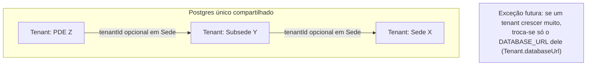
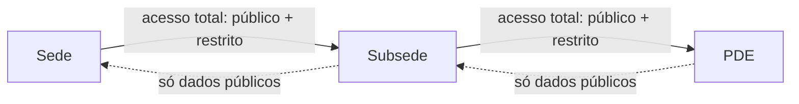
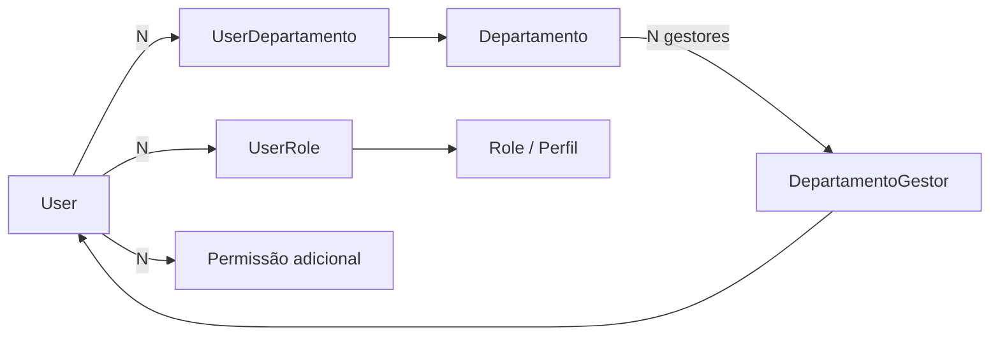
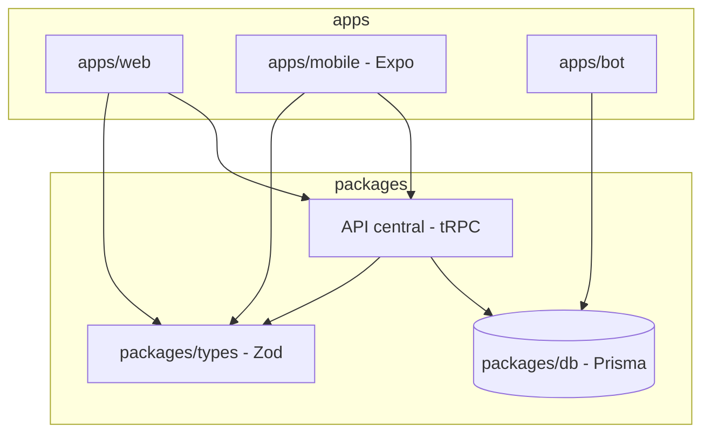

# Arquitetura — Torcida SaaS

> Documento vivo. Atualizar sempre que uma decisão estrutural mudar.
> Última revisão: 2026-07-10

## 1. Visão geral do produto

Plataforma para torcidas organizadas de futebol, com hierarquia de três níveis:

```
Sede (torcida principal)
 └─ Subsede
     └─ PDE (Ponto de Encontro)
```

Modelo de venda é **bottom-up**: qualquer nó pode assinar primeiro (ex: um PDE),
antes da sede-mãe aderir. Quando a sede aderir, os nós filhos se conectam a ela.

Canais do produto:
- **Discord bot** (`apps/bot`) — canal original, ainda em uso ativo.
- **Web** (`apps/web`) — portal (usuário final) + admin (gestão da torcida) + super-admin.
- **Mobile** (planejado) — React Native/Expo, reaproveitando o mesmo backend do web.

---

## 2. Arquitetura atual (as-is)

### 2.1 Repositório

```
botpde/ (monorepo pnpm + turborepo)
├── apps/
│   ├── bot/          Discord bot — JS puro, discord.js, pg direto (sem Prisma)
│   └── web/           Next.js 16 + React 19 — portal, admin, super-admin
└── packages/
    ├── db/            Prisma schema único, compartilhado por quem o importar
    ├── types/          Schemas Zod + permissões compartilhadas
    └── ui/             Componentes React + services (form, dialog, toast...)
```

### 2.2 Dados

- **Um único Postgres compartilhado** (Railway). Multi-tenancy é **lógica**,
  via coluna `tenantId` nas tabelas `saas_*`.
- **Duas gerações de schema coexistindo na mesma base:**
  - Tabelas legadas do bot (`membros`, `produtos`, `pedidos`, `bot_config`...)
    — lidas via `pg` puro pelo bot, e via Prisma (read-oriented) pelo web.
  - Tabelas novas `saas_*` (Tenant, User, Role, Sede, Evento, SaasProduto...)
    — usadas pelo web via Prisma. O bot ainda não escreve nelas.
- `Tenant.databaseUrl` **já tem o mecanismo implementado** —
  `getDbForTenant(tenant)` em `packages/db/src/index.js` retorna um
  `PrismaClient` isolado (com cache por tenant) quando `databaseUrl` está
  preenchido, ou o client compartilhado quando não está. *Correção
  (2026-07-02): revisão anterior deste documento dizia que não havia lógica
  nenhuma — havia, só não é **usada** em nenhuma query do `apps/web` ainda
  (tudo importa `db` direto, não `getDbForTenant`). Ou seja: o mecanismo de
  fuga pra banco dedicado já existe, só falta alguém chamá-lo.*
- Hierarquia de `Sede` já modelada corretamente: auto-relação `sedeId` (pai)
  / `filhos`, e `tenantId` **opcional** — permite um nó existir antes de
  virar tenant (`sedeReferenciaNome` / `sedeReferenciaSlug` guardam a
  referência à sede-mãe ainda não cadastrada).
- Não existe hoje nenhuma regra de **visibilidade cross-tenant** (o que uma
  subsede pode ver da sede, e vice-versa). Cada tenant é uma ilha.
- **Módulo Salas (Meet)**: videoconferência em tempo real dentro de Comunidade,
  via LiveKit/WebRTC — **opcional** (`isLiveKitConfigured()`; sem config, a sala
  ainda funciona como chat/enquetes/presença). Presença e chat/enquetes usam
  polling, não websocket próprio; só áudio/vídeo e o gesto de "levantar a mão"
  usam o data channel do LiveKit. Autorização de host é uma única permissão
  (`meetings:host`); votantes de enquete só são visíveis ao host (privacidade).
  Ver `docs/data/modulo-salas.md`.

### 2.3 Autenticação e autorização

- NextAuth v5 (JWT), providers Discord + Google, unificação de conta por
  e-mail/providerAccountId.
- RBAC por tenant: `Role` (com array de `permissions`), `UserRole`,
  `UserPermission` (overrides pontuais). Tudo escopado por `tenantId` —
  não existe hoje o conceito de papel/permissão que atravesse tenants
  (ex: "admin da sede vê tudo das subsedes").

### 2.4 API / integração mobile

- Não existe uma camada de API formal. O `apps/web` usa Server
  Components/Server Actions do Next.js falando direto com Prisma —
  a única rota de API real é `NextAuth` (`/api/auth/[...nextauth]`).
- **Consequência prática:** hoje não há nada reutilizável para o mobile.
  Qualquer app RN vai precisar de uma API nova, independente do formato
  escolhido (REST, tRPC, etc).
- **Catálogo da superfície de escrita** (as-is) mapeado em
  `docs/api/server-actions.html` — doc navegável (estilo Scalar) de cada
  Server Action: gate de permissão, validação Zod, escritas no banco e
  `AuditLog`. Regenerar quando novas actions forem criadas.
- **Achado de auditoria (2026-07-07, resolvido):** o catálogo expôs que
  `criarTenantInicial` e `atribuirOwnerAction` (super-admin,
  `app/super-admin/setup/actions.ts`) **não gravavam `AuditLog`**, violando a
  convenção "toda mutação administrativa grava AuditLog". Corrigido no mesmo dia
  (`TENANT_CRIADO` / `OWNER_ATRIBUIDO`) — ver §6.

### 2.5 Deploy / custo

- Railway, 4 serviços/projetos:
  - `torcida-web` — Next.js standalone (Nixpacks).
  - `bot-pde` (nome do serviço no Railway: `botpde`) — bot atual (`apps/bot`),
    Root Directory = `apps/bot`, build via `npm install` isolado (não vê o
    resto do monorepo). Funciona bem para o `pg` cru que o bot usa hoje —
    mas **não suporta dependências `workspace:*`** (ver item 4: tentativa de
    usar `@torcida/db` quebrou o deploy, revertida em 2026-07-06).
  - `dbo-bot-pde` — Postgres addon. **Confirmado (2026-07-01) que é o
    mesmo banco usado por `torcida-web`** — mesmas credenciais e mesmo
    database, não é addon duplicado, sem custo morto aqui. Desde 2026-07-19
    tanto `bot-pde` quanto `torcida-web` usam o host **interno**
    (`postgres.railway.internal`) via private networking; o proxy público
    (`*.proxy.rlwy.net`) ficou só para acesso externo (scripts/`db:push`
    locais). A troca resolveu a rajada de `PrismaClientKnownRequestError:
    Can't reach database server` (P1001) que vinha do proxy público —
    resiliência adicional (timeouts + `withDbRetry` em leituras) em
    `packages/db/src/index.js` e `packages/db/src/with-db-retry.js`.
  - `bot-fivem` — produto anterior/paralelo, ainda ativo, sendo migrado
    aos poucos para o web/mobile atual.
- Hobby Plan: $5/mês incluídos, uso atual ~$2.45/mês estimado — dentro da
  margem, sem necessidade de trocar de provedor no MVP.
- **Plano de investimento em infra (2026-07-23):** faixas A–D (fundação →
  escala ads), alinhadas a demo/1ª carga e modelo de receita via publicidade —
  ver `docs/ops/plano-investimento-infra.md`. Não migrar provedor sem critério
  §5.4 e medição (`PERF_METRICS`).

---

## 3. Arquitetura alvo (to-be)

### 3.1 Princípio geral

**Isolamento lógico agora, isolamento físico só onde for necessário depois.**
Nada de banco por torcida/subsede/PDE como regra — isso explode custo e
complexidade de query (uma sede consultando 20 PDEs em 20 bancos físicos é
uma operação distribuída cara). O `databaseUrl` no `Tenant` continua
reservado para o caso raro de uma torcida específica crescer sozinha a
ponto de justificar banco dedicado — migração pontual, não arquitetura padrão.



### 3.2 Hierarquia e visibilidade — resolvida por autorização, não por infra

Usar a árvore de `Sede` (já existe) para decidir acesso, com uma
classificação de dado em duas categorias:

- **Público-na-hierarquia**: loja, localização, comunidade/mural, eventos
  públicos — visível para ancestrais E descendentes.
- **Restrito**: membros, sócios, financeiro/pedidos, dados pessoais —
  visível apenas para o próprio tenant **e seus ancestrais** (sede vê tudo
  da subsede/PDE; subsede/PDE não vê o restrito de irmãos ou da sede).



**✅ Implementado (2026-07-03).** Dividido em duas camadas:
- Regra pura em `packages/types/src/visibility.js` — `RECURSO_SENSIBILIDADE`
  (mapa recurso → `publico`/`restrito`) e `resolveVisibility(relation, sensibilidade)`
  / `canViewRecurso(relation, recurso)`, testado isoladamente (self/ancestor
  sempre veem tudo; descendant só vê público; unrelated não vê nada).
- Resolução de hierarquia (precisa de banco) em `apps/web/src/lib/hierarquia.ts`
  — `getTenantRelation(actorTenantId, targetTenantId)` sobe/desce a árvore de
  `Sede` a partir do `tenantId` de cada nó; `resolveVisibility()` (wrapper
  assíncrono) combina os dois; `getTenantHierarquia(tenantId)` monta a sede-mãe
  + lista de descendentes prontos pra exibir.
- Primeira superfície real: `/admin/hierarquia` — mostra a sede-mãe (só dados
  públicos) e as subsedes/PDEs (com métricas restritas — membros ativos,
  sócios — porque olhar descendente é a única direção em que a regra permite
  ver dado restrito). Gate por `SEDES_MANAGE` via `assertPermission`.

### 3.2b Controle de acesso — Departamentos, Perfis e Permissões

> Inspirado em cargos do Discord + revisão de um sistema de controle de
> acesso corporativo de referência. Atualizado 2026-07-14: departamento
> **concede** permissões; membro ≠ gestor.

Dois eixos independentes, escopados por tenant (contrato = sede/subsede/pde):

- **Departamento** (`Departamento`) — unidade de acesso **e** agrupamento
  organizacional (Diretoria, Financeiro, Comunicação…). Carrega
  `permissions[]` (membro/equipe) e `permissionsGestor[]` (a mais, para quem
  é gestor). Sócio/Torcedor **não** são departamento — são `SaasMembro.tipo`.
  Lista plana por tenant no MVP.
- **Perfil** (`Role`) — agrupamento transversal de permissões
  (`permissions: String[]`).
- **Permissões adicionais** (`UserPermission`) — override pontual
  (`granted: true/false`).

```
efetivas = ∪ Role.permissions
         ∪ (membro ? Departamento.permissions : [])
         ∪ (gestor ? Departamento.permissionsGestor : [])
         ± UserPermission overrides
```



**Gestão delegada** (`DepartamentoGestor` + `canManageDepartamento`): quem tem
`ROLES_MANAGE` gerencia tudo; gestor de um departamento pode incluir/remover
membros **daquele** departamento (`adicionarMembroDepartamento` /
`removerMembroDepartamento` em `/admin/acessos/actions`).

**UI**: `/admin/acessos` com três seções — **Pessoas** (atribuição), **Cargos**
e **Departamentos** (CRUD de templates). **Sem** FK `Role ↔ Departamento` — os
eixos somam no usuário. Bootstrap de tenant semeia os 10 deptos canônicos
(`upsertDepartamentosCanonicos`). Hub portal: `/portal/departamentos`.

**Visão da torcida** (`/admin/torcida`): worktree híbrida = árvore de `Sede`
do tenant (onboarding) + Tenants filhos quando existentes; KPIs por
`SaasMembro.sedeId`. Gate: `TORCIDA_GLOBAL_VIEW` + Sede `tipo: SEDE`.
Ver `docs/data/modulo-departamentos.md`.

**Planejado:** o Presidente poderá, a partir da worktree, acessar afiliadas
(membros, sócios, relatórios, financeiro) — escopo/UX a definir; o
relacionamento hierárquico na Visão já está ok.### 3.3 Unificação bot ↔ web

- Bot para de falar Postgres cru via `pg` e passa a usar `@torcida/db`
  (Prisma), mesmo cliente e mesmo schema que o web.
- Tabelas legadas (`membros`, `produtos`, `pedidos`) migram gradualmente
  para as equivalentes `saas_*`, com script de migração de dados —
  até então seguem lidas em paralelo (como hoje).

**⚠️ Bloqueada por infraestrutura de deploy (2026-07-06)**: implementação
tentada (VIN-11/13/14) e **revertida** — o serviço `botpde` no Railway
builda com Root Directory=`apps/bot` e `npm install` isolado, sem acesso ao
resto do monorepo. `@torcida/db` (`workspace:*`) não resolve nesse contexto
(`npm error Unsupported URL Type "workspace:"`), quebrando 3 deploys
seguidos antes de ser identificado. Retomar só depois de decidir entre:
(a) mudar o Root Directory do `botpde` pra raiz do repo + `pnpm` (igual
`torcida-web` já faz — a correção "de verdade", mas exige mudança no
painel do Railway, possivelmente com "Config-as-code" apontando pro
`apps/bot/nixpacks.toml`/`railway.toml` específico, não testado ainda); ou
(b) vendorizar uma cópia do schema Prisma só pro bot (evita mexer no
Railway, mas reintroduz duplicação de schema — mesma classe de problema
que a remoção do `src/` legado, item 1, resolveu).

### 3.4 Camada de API para mobile

**Prioridade nº 1 é interna, não externa**: a API central existe primeiro
para fazer sede, subsede e PDE trocarem informação entre si (respeitando a
regra de visibilidade da seção 3.2) e para o `apps/mobile` consumir o mesmo
backend que o web. Integração com terceiros **não é objetivo do MVP**.

Formato escolhido: **tRPC**, dentro do monorepo (ex: rotas
`app/api/trpc/[trpc]/route.ts` em `apps/web`, ou pacote `packages/api`),
consumido por `apps/web` e pelo futuro `apps/mobile` (Expo). Motivo:

- Stack já é TypeScript ponta a ponta (Next.js, Prisma, Expo) — tipagem
  end-to-end sem escrever contrato manual.
- Reaproveita os schemas Zod que já existem em `packages/types`, que é
  exatamente o formato de validação que o tRPC espera.
- Não exige servidor/infra separada — roda dentro do `apps/web` atual.



**Fase futura (pós-MVP, fora de escopo agora):** expor uma camada REST fina
por cima do tRPC quando surgir demanda real de integração com terceiros
(ex: outra torcida parceira consumindo dados via webhook, integração de
pagamento externa, parceiros comerciais). Não antecipar isso agora —
adiciona superfície de API pública, versionamento e autenticação de
terceiros que o MVP não precisa.

### 3.5 Deploy / custo

- Manter Railway no MVP (dentro do Hobby Plan).
- Ação imediata: confirmar se `dbo-bot-pde` é o único Postgres em uso
  (comparar `PGHOST` com o que `torcida-web`/`bot-pde` realmente usam) e
  desligar addon duplicado se houver.
- Reavaliar hosting só quando o uso real se aproximar do limite do plano
  (sinal: estimated bill encostando nos $5, ou latência/RAM no limite).

---

## 4. Plano de convergência (as-is → to-be)

| # | Item | Ação | Bloqueia o quê |
|---|------|------|-----------------|
| 1 | ~~`src/` legado na raiz~~ | ✅ Removido em definitivo (2026-07-06, VIN-9), decisão conjunta após análise: confirmado idêntico a `apps/bot/src` (diff vazio), zero configs de build/deploy referenciando o `src/` da raiz (Railway do `bot-pde` roda com Root Directory `apps/bot`), nenhum dos dois tocado desde a migração pro monorepo. Remover não apaga histórico do Git (`git log --all -- src/` continua funcionando). Achado colateral corrigido junto: `apps/bot/src/assets/` estava no `.gitignore`, deixando `pdelogo.png` (usado em runtime por `apps/bot/src/events/ready.js`) sem nenhuma cópia versionada — corrigido antes da remoção (git detectou como rename, preservando o blob) | — |
| 2 | ~~`dbo-bot-pde`~~ | ✅ Confirmado: mesmo banco de `torcida-web`, sem ação necessária | — |
| 3 | ~~Visibilidade cross-tenant~~ | ✅ Feito (2026-07-03): `resolveVisibility`/`canViewRecurso` (`packages/types`) + `getTenantRelation`/`getTenantHierarquia` (`apps/web/src/lib/hierarquia.ts`) + página `/admin/hierarquia` provando o fluxo real | — |
| 22 | ~~Aplicar `resolveVisibility` em mais telas~~ | ✅ Feito (2026-07-05) para comunidade e eventos; ✅ Feito (2026-07-10) para loja (superado em 2026-07-27: portal trocou o catálogo mesclado por listagem de lojas por unidade via `tenantsPermitidosLoja` — ver `docs/data/modulo-loja.md`) | — |
| 25 | ~~PRD "torcida organizada" — 8 regras de negócio~~ | ✅ Feito (2026-07-05), sem reescrever a arquitetura (decisão de escopo do usuário): (1) `SaasMembro.sedeId` — vínculo territorial explícito, escolhido no cadastro quando o tenant tem mais de uma `Sede`; (2)+(3)+(4) `Announcement`/`AnnouncementRead` (novo, distinto de `Post`) — comunicado oficial com prioridade/pin, gated por nova permissão `announcements:publish` (separada de `community:manage`), sempre ordenado acima do mural local em `getFeedComunidade()`; (5) moderação segue restrita ao próprio tenant (mesmo padrão de `tenantId` nas queries; itens herdados de ancestrais renderizam sem controles de edição); (6) eventos globais vs. restritos a uma unidade via `Evento.sedeId` + `SaasMembro.sedeId`; (7) `EventoRsvp.checkedInAt/checkedInPorId` — check-in real independente do status de RSVP, com botão dedicado em `/admin/eventos/[id]`; (8) `assertMembroAtivo()` (novo, `authz.ts`) bloqueia RSVP de membro pendente/reprovado ou sócio com carteirinha vencida. ⚠️ Nova permissão exige rodar `repair-system-role-permissions.js` depois do `db push` (mesmo padrão do item 18) | — |
| 23 | ~~Bug crítico: `usuarioId` em vez de `atorId` no AuditLog~~ | ✅ Corrigido (2026-07-03): `admin/eventos/actions.ts`, `admin/sedes/actions.ts` e `portal/cadastro/actions.ts` gravavam `auditLog.create({ data: { usuarioId: ... } })`, mas o campo do schema é `atorId`. Sem `try/catch`, isso quebrava em runtime (Prisma "unknown argument") **depois** do registro principal já ter sido salvo — ou seja, criar/editar evento, criar/editar/ativar sede e enviar cadastro de torcedor todos quebravam com erro 500 mesmo tendo escrito o dado. TypeScript não acusava por causa do mesmo teto de inferência descrito na seção 5.2 (o objeto `data` silenciosamente virava `any`) | — |
| 24 | ~~Ciclo na árvore de Sede~~ | ✅ Corrigido (2026-07-03): `editarSede` deixava escolher qualquer sede como pai, inclusive uma descendente da própria sede — isso criaria um ciclo que travaria para sempre `getTenantRelation`/`getTenantHierarquia` (recursão infinita). Adicionado `wouldCreateSedeCycle()` em `apps/web/src/lib/hierarquia.ts`, chamado em `editarSede` antes de gravar; `descendantTenantIds` também ganhou um guard de `visitados` como defesa em profundidade | — |
| 4 | Bot → Prisma | ⚠️ Tentado e **revertido** (2026-07-06): `@torcida/db` (`workspace:*`) quebra o build do serviço `botpde` no Railway (Root Directory=`apps/bot`, `npm install` isolado não resolve o protocolo `workspace:`). Revertido pra `pg` cru (ver seção 3.3). Bloqueado até decidir entre mudar Root Directory pra raiz + `pnpm`, ou vendorizar o schema | Unificação de dados, pré-requisito pra API central completa |
| 5 | Camada de API (tRPC) | Criar `packages/api` (ou rotas tRPC em `apps/web`) focada em uso interno entre hierarquia + mobile | App mobile e troca de dados sede/subsede/PDE |
| 6 | `apps/mobile` | Scaffold Expo, consumindo a API central | Lançamento mobile |
| 7 | API REST pública | **Fora de escopo do MVP** — só entra no roadmap quando houver demanda real de integração com terceiros | Integrações externas (futuro) |
| 8 | ~~Schema Departamento/Perfil~~ | ✅ Feito (2026-07-01): `Departamento`, `UserDepartamento`, `DepartamentoGestor` adicionados ao Prisma schema, `canManageDepartamento()` em `packages/types` | — |
| 9 | ~~UI de atribuição de acesso~~ | ✅ Feito (2026-07-02): `/admin/acessos` — edição por usuário (perfis, departamentos com gestor opcional, permissões efetivas/adicionais). `DepartamentosManager` (CRUD) adicionado em `/admin/configuracoes`. Ver nota de escopo abaixo | — |
| 10 | ~~Migração de banco~~ | ✅ Aplicada (2026-07-02) via `prisma db push` em produção: `saas_departamentos`, `saas_user_departamentos`, `saas_departamento_gestores` e todos os índices novos criados | — |
| 11 | ~~Coerência do schema~~ | ✅ Feito (2026-07-02): `Advertencia` sem relação de `Tenant` corrigido; índices adicionados em toda coluna `tenantId`/FK usada em query multi-tenant (`Sede`, `Evento`, `SaasProduto`, `SaasPedido`, `Post`, `AuditLog`, `UserRole`, `UserPermission`, `UserDepartamento`, `DepartamentoGestor`) | — |
| 12 | ~~Permissão desde o primeiro acesso~~ | ✅ Feito (2026-07-02): aprovar `SaasMembro` auto-concede Role `member` via `concederAcessoBasico()`. **Atualizado 2026-07-17:** departamento do onboarding é preferência (`SaasMembro.departamentoId`), não membership — só aplica em `aprovarMembro` | — |
| 13 | ~~Menu do admin gated por permissão~~ | ✅ Feito (2026-07-02): `ADMIN_MENU` + `filterMenuByPermissions`/`hasAdminAreaAccess` em `packages/types/src/menu.js`; `admin/layout.tsx` e `AdminSidebar` agora filtram por permissão efetiva em vez de nome de cargo hard-coded | — |
| 14 | ~~Cargos de sistema desalinhados~~ | ✅ Corrigido (2026-07-02): seed de `owner`/`admin`/`member` em `super-admin/setup/actions.ts` usava strings em português (`membros:ler`, `sedes:editar`...) divergentes do vocabulário canônico (`members:view`, `sedes:manage`...) usado pela UI de cargos e por `packages/types`. Agora usa `SYSTEM_ROLES`/`SYSTEM_ROLE_PERMISSIONS` compartilhados | ⚠️ ver nota de migração abaixo |
| 17 | ~~Gestão de perfis aprimorada~~ | ✅ Feito (2026-07-02), inspirado na tela de Perfis/Permissões de referência: cascata de dependência (`applyPermissionCascade` em `packages/types` — marcar permissão não-base puxa a base do grupo, ex. `members:view`; desmarcar a base derruba as irmãs), aplicada na UI E no servidor (cargos e acessos); diff visual verde/vermelho com contadores por grupo na edição; busca por nome/permissão; confirmação com resumo das mudanças; exclusão bloqueada para cargo em uso (contagem exibida); validação de ≥1 permissão | — |
| 15 | ~~Reparo de dados em produção~~ | ✅ Rodado (2026-07-02) via `packages/db/scripts/repair-system-role-permissions.js`: 0 correções necessárias — o único tenant existente (`pde-gavioes-fiel`) já tinha as 3 roles de sistema com permissões canônicas (foi criado via `prisma/seed.js`, que nunca teve o bug — só o wizard `super-admin/setup` tinha). Script fica registrado (`pnpm --filter @torcida/db db:repair-system-roles`) como rede de segurança idempotente para o futuro | — |
| 18 | ~~Sistema de comunidade~~ | ✅ Feito (2026-07-02): `/admin/comunidade` (CRUD de posts, fixar/desafixar, gate por `COMMUNITY_MANAGE`) + `/portal/comunidade` (feed somente-leitura, fixados primeiro). Usa o model `Post` que já existia no schema (nunca tinha UI). Nova permissão `community:manage` exigiu rodar `repair-system-role-permissions.js` de novo — owner/admin em produção ganharam a permissão retroativamente | — |
| 19 | ~~Sistema de comunidade — sem interação~~ | ✅ Feito (2026-07-10): feed social com posts de membros, comentários, reações (CURTIR/FORCA), perfil unificado (`/portal/comunidade/perfil/[id]`) com banner/avatar, abas (Sobre, Publicações, Fotos, Atividade), seguimento com aprovação, busca de membros, privacidade de perfil e visibilidade por post. Ver `docs/data/modulo-comunidade.md` | — |
| 20 | ~~`packages/ui` — design system real~~ | ✅ Feito (2026-07-02): extraídos `FieldError`, `Input`/`Select`/`Textarea`, `SubmitButton`, `Badge`, `PageHeader`, `Card` — eram copiados byte-a-byte em 6+ arquivos (`evento-forms`, `post-forms`, `sede-forms`, `cadastro-form`, `perfil-form`, parcialmente `produto-forms`). Build real com `tsup` (`dist/` com `.js`/`.mjs`/`.d.ts`), sem alterar como `apps/web` consome o pacote hoje (`exports` continua apontando pro `src`, o build é uso externo/futuro). Motivação: preparar pra sincronizar com claude.ai/design (`/design-sync`) depois — hoje não havia nada buildável pra sincronizar | — |
| 21 | Migrar admin/loja para os componentes do design system | `produto-forms.tsx` tem estilo de input divergente (sem focus ring, padding menor) — não migrado agora pra não arriscar regressão visual sem visualizar. Unificar quando alguém revisar a tela da loja | Consistência visual completa |
| 26 | ~~Roteamento por subdomínio real~~ | ✅ Preparado (2026-07-05): `ROOT_DOMAIN` validada em `apps/web/src/lib/env.ts`, `tenant.ts` já usava a lógica certa (só faltava a env var validada). Testável agora **sem domínio próprio** via `ROOT_DOMAIN=lvh.me` (`*.lvh.me` resolve pra `127.0.0.1`, sem DNS). `auth.ts` ganhou cookie de sessão compartilhado entre subdomínios (`cookies.sessionToken.domain = .${ROOT_DOMAIN}`) — sem isso, logar em `sede.lvh.me` não mantinha sessão em `subsede.lvh.me`. Script `promover-subsede-para-tenant.js` promove uma `Sede` de teste a `Tenant` de verdade, reaproveitando o mesmo usuário owner | Só falta domínio real — ver nota de produção abaixo |
| 27 | ~~Segundo método de login (e-mail/senha)~~ | ✅ Feito (2026-07-05): `User.senhaHash` (nullable, só contas com senha têm), provider `Credentials` em `auth.ts` (bcrypt.compare, erro genérico — não diferencia e-mail inexistente de senha errada), `/entrar/criar-conta` (cadastro) e formulário de senha em `/entrar`. Callback `jwt` ganhou ramo específico pra `account.provider === 'credentials'` (usa `user.id` direto, os ramos de discordId/googleId não se aplicam). **Decisão deliberada**: conta com senha NÃO mescla com conta OAuth existente do mesmo e-mail (evita takeover) | Reset de senha (item 28) |
| 28 | "Esqueci minha senha" | Fora de escopo por decisão do usuário — exige provedor de e-mail transacional (nenhum configurado no projeto ainda, ex: Resend). Enquanto não existir, reset é manual (direto no banco) | Fluxo de recuperação completo |
| 29 | ~~Rate-limit de login~~ | ✅ Feito (2026-07-06): `apps/web/src/lib/rate-limit.ts` (in-memory, sem Redis/Upstash — 5 tentativas/15min por e-mail, aceitável no estágio atual de baixo tráfego e única instância). Já existia desde antes desta revisão, mas só era chamado na Server Action de `/entrar` — uma chamada direta a `/api/auth/callback/credentials` (pulando a UI) contornava o limite. Corrigido movendo a aplicação real (`excedeuLimite`/`registrarTentativaFalha`) para dentro do `authorize()` do provider Credentials em `lib/auth.ts`, o único ponto por onde toda tentativa de login passa de fato. Server Action mantém só a checagem rápida (evita round-trip) | Reavaliar store compartilhado (Redis/Upstash) antes de escalar para múltiplas instâncias |
| 30 | ~~Loja SaaS — sacola, cupom, multi-item~~ | ✅ Feito (2026-07-10): modelos `SaasCategoria`, `SaasCupom`, `SaasCarrinhoItem`, `SaasPedidoItem`; `SaasPedido` refatorado como cabeçalho (subtotal, desconto, cupom, retirada/envio, `grupoCheckoutId`); portal com sacola + checkout; admin com categorias/cupons; `STORE_VIEW_ORDERS` para leitura de pedidos; seed Gaviões (`pnpm --filter @torcida/db seed:loja-gavioes`). Ver `docs/data/modulo-loja.md`. Fora de escopo: gateway de pagamento, frete por CEP, bridge Discord ticket | — |

## 5. Decisões fechadas nesta revisão

- API central = **tRPC**, com foco inicial em uso **interno** (hierarquia
  sede/subsede/PDE + mobile). REST para terceiros fica documentado como
  fase futura, não meta do MVP.
- `dbo-bot-pde` confirmado como o mesmo Postgres do `torcida-web` — sem
  banco duplicado, sem ação de custo pendente.
- Aprovação de `SaasMembro` concede Role `member` via `concederAcessoBasico()`.
  Departamento pretendido no onboarding (`SaasMembro.departamentoId`) **não** é
  membership: só vira perfil `Membro · {Área}` + `UserDepartamento` em
  `aprovarMembro` (default), ou fica de fora com `{ incluirDepartamento: false }`.
  Sócio/Torcedor **nunca** foram departamentos — ver `modulo-departamentos.md`
  (2026-07-17). Atribuições extras continuam manuais em `/admin/acessos`.
- Árvore de menu do admin fica **estática no código** (`packages/types`),
  não configurável via banco no MVP.
- Permissões efetivas são resolvidas **no servidor a cada request**
  (já era o comportamento de `getUserPermissionsInTenant`), não embutidas
  no JWT — evita permissão desatualizada sem novo login.

### 5.1 UI de atribuição de acesso (item 9) — o que entrou e o que ficou de fora

- `/admin/acessos`: lista os usuários do tenant (qualquer um com `SaasMembro`,
  `UserRole`, `UserDepartamento` ou `UserPermission` no tenant atual) e permite
  editar, por usuário: perfis (multi-select), departamentos (multi-select,
  com checkbox "gestor" por departamento selecionado) e **permissões
  efetivas** — uma lista única de checkboxes que representa o resultado
  final desejado (vem do perfil OU é concessão/revogação pontual); o server
  action (`salvarAcessoUsuario`) calcula o diff mínimo contra o estado atual
  e só grava overrides em `UserPermission` quando o efetivo desejado diverge
  do que o(s) perfil(is) já dariam — implementa exatamente a semântica de
  `calculateEffectivePermissions` (perfil ∪ overrides) de trás pra frente.
- Gate de acesso por **permissão granular** (`ROLES_MANAGE`) via helper
  `assertPermission()` em `apps/web/src/lib/authz.ts` — não por nome de
  cargo. **Atualização (2026-07-06, item 16): esse critério agora é o único
  em todo o admin** — ver seção 5.3.
- Também extraído: `assertAdmin`/`assertOwner` estavam duplicados em 2
  arquivos (`membros/actions.ts`, `configuracoes/actions.ts`) — agora vivem
  só em `apps/web/src/lib/authz.ts`. `PERMISSION_GROUPS` (labels de UI por
  permissão) também deixou de estar hard-coded em `config-forms.tsx` e virou
  export de `packages/types`.
- **Fora do escopo desta rodada** (fast-follow se precisar): grant/revoke em
  lote pra múltiplos usuários ao mesmo tempo (o v1 edita um usuário por vez).

### 5.2 Achado técnico: anotação explícita de tipo é obrigatória em queries novas do Prisma

Ao escrever `/admin/acessos`, `db.role.findMany(...).map(...)` (e padrões
equivalentes) passaram a falhar com `implicit any`/`unknown` no `tsc`, **sem
nenhum erro no arquivo que gerou o dado** — só nos usos seguintes. Isolado e
confirmado: é um teto de profundidade de inferência do TypeScript contra os
tipos condicionais gerados pelo Prisma para este schema (43 models bem
relacionados, contagem em 2026-07-08) — a inferência automática do retorno de `findMany`/`findUnique`
simplesmente para de funcionar de forma **silenciosa** a partir de um certo
ponto, sem "excessively deep" explícito.

**Regra a partir de agora**: sempre anotar explicitamente o tipo do retorno
de queries Prisma novas (`const x: MinhaInterfaceLite[] = await db.modelo.findMany(...)`),
em vez de depender de inferência automática — isso faz o TypeScript checar
assinalabilidade (mais raso) em vez de re-inferir o tipo completo (mais
profundo). Ver `apps/web/src/app/admin/acessos/actions.ts` e `page.tsx` para
o padrão (`RoleLite`, `DepartamentoLite` etc.).

### 5.3 Item 16 resolvido — assertPermission é o único critério de autorização do admin

`assertAdmin`/`assertOwner` (nome de cargo de sistema `owner`/`admin`) foram
removidos de `apps/web/src/lib/authz.ts` — não têm mais nenhum caller.
Substituídos por `assertPermission(PERMISSION)` em todo `apps/web/src/app/admin/**`:

- `sedes/actions.ts` → `SEDES_MANAGE`
- `loja/actions.ts` → `STORE_MANAGE` (produtos, categorias, cupons, mutação de
  status de pedido); leitura de pedidos em `/admin/loja/pedidos` via
  `assertStoreView()` (`STORE_VIEW_ORDERS` **ou** `STORE_MANAGE`)
- `eventos/actions.ts` → `EVENTS_CREATE` (criar) / `EVENTS_MANAGE` (editar,
  check-in, excluir)
- `membros/actions.ts` → `MEMBERS_APPROVE` (aprovar/reverter) /
  `MEMBERS_REJECT` (reprovar)
- `socios/actions.ts` → `MEMBERS_APPROVE` (emitir/renovar/revogar
  carteirinha — não existe permissão dedicada a "sócio"; reaproveita a mais
  próxima do fluxo de aprovação de associado, decisão a revisitar se virar
  demanda)
- `configuracoes/actions.ts` → `SETTINGS_MANAGE` (perfil do tenant, Discord
  guild — únicas ações que eram `assertOwner`, e `SETTINGS_MANAGE` já é
  exclusiva do owner via `SYSTEM_ROLE_PERMISSIONS`) / `ROLES_MANAGE` (cargos
  e departamentos, mesmo critério já usado em `/admin/acessos`)

Sem regressão para `owner`/`admin` (ambos já têm todas as permissões
granulares via `SYSTEM_ROLE_PERMISSIONS`); um perfil customizado com a
permissão certa passa a acessar a ação equivalente sem precisar do cargo de
sistema. `AuthzResult` (tipo de retorno de `assertPermission`) parou de
derivar de `assertAdmin` (removido) e passou a usar o tipo `Session` de
`next-auth` diretamente — `ReturnType<typeof auth>` não funciona aqui porque
o `auth` do NextAuth v5 é uma função com múltiplos overloads (middleware e
sessão) e a utility type resolve para a assinatura errada.

Testes: `pnpm --filter @torcida/web test` (suíte da VIN-6) continuam verdes,
já que não tocam em `packages/types`. Nenhum teste cobre `assertPermission`
em si (depende de sessão/banco) — cobertura por typecheck + smoke manual.

**Invariante de tenant em mutações (trava R2 da governança hierárquica).** O
`tenantId` de qualquer Server Action de mutação vem **sempre** do `tenant.id`
retornado pelo assert (`assertPermission`/`assertAnyPermission`), **nunca** de um
`tenantId` recebido pelo input (formData/Zod). É o que impede um ator de tenant
descendente (subsede/PDE) de mutar dados do tenant ancestral (Sede) — a leitura do
tenant ativo é derivada do vínculo de sócio aprovado do próprio ator
(`getActiveTenant` em `lib/tenant.ts`), não do request. Exceções conscientes e
auditadas: fluxos de **super-admin** (cross-tenant por definição, com gate
`isSuperAdminEmail`) e o **self-service pré-membership** do onboarding
(`solicitarVinculo`/`registrarInteresseUnidade`, onde o `tenantId` de input é o
alvo que o próprio usuário escolhe e só cria registro PENDENTE do próprio usuário).
Auditoria de 2026-07-20 (Fase 0 da governança hierárquica) não achou nenhuma
mutação que viole o invariante. Ver `docs/data/proposta-governanca-hierarquica.md`.

### 5.4 Provedor de banco — Railway mantido; Prisma Postgres NÃO adotado (2026-07-07)

Decisão de arquitetura de infra, avaliada com prioridade em custo baixo/zero,
simplicidade e baixo risco. **Banco ativo continua o Railway Postgres**
(`dbo-bot-pde`, ver §2.5). O **Prisma Postgres** que aparece no console
`console.prisma.io` **existe mas NÃO é o banco da aplicação** — é uma instância
separada e vazia (mostra "connect your database to start seeing usage").
Prisma é usado apenas como **ORM**, apontando para o Railway via `DATABASE_URL`
(`packages/db/.env`). Não confundir os dois.

Por que manter Railway (sem migrar):
- Já está em produção, funcionando, e co-hospeda `web` + `bot` + Postgres no
  mesmo provedor — menos superfície operacional.
- Custo já baixo (~$2.45/mês dentro do Hobby de $5) — a economia do free tier
  do Prisma Postgres seria marginal e só sobre o DB (o resto segue no Railway).
- **Fator decisivo:** o `bot` acessa o banco com `pg` cru, não Prisma. Prisma
  Postgres é pensado para acesso via Accelerate (pooler/proxy). Migrar exigiria
  retrabalhar o acesso do bot — custo/risco reais por ganho pequeno.
- Conexão TCP direta combina com a arquitetura atual (Next server + bot
  long-running), não serverless.

Quando Prisma Postgres faria sentido no futuro (só neste combo, não antes):
mover o deploy para **serverless/edge** (ex.: Vercel) **e** aposentar o acesso
`pg` cru do bot, indo 100% Prisma — aí o pooling do Accelerate resolve
esgotamento de conexão em serverless e o free tier passa a valer. `Tenant.databaseUrl`
(§3.1) segue reservado para isolamento físico pontual, independente do provedor.

Melhorias ortogonais ao provedor (não são migração): confirmar backups
automáticos do Railway ligados; considerar migrations versionadas para produção
quando o schema estabilizar (hoje o fluxo é `db push`, sem migrations).

### 5.5 Captura visual de fluxo para revisão de UI/UX — Playwright, sem MCP dedicado (2026-07-08)

Adicionado `apps/web/e2e/` (Playwright) para navegar os fluxos principais e
salvar PNGs em `apps/web/e2e/screenshots/<fluxo>/` (não commitado — artefato
local). Objetivo: alimentar o agente `ux-review` (que aciona o skill
`impeccable`) com evidência real de tela em vez de inferência por JSX. Ver
`apps/web/e2e/README.md`.

Por que Playwright (test suite) e não um MCP de browser dedicado:
- O pedido é **repetível e versionável** ("rodar e salvar imagem de cada
  fluxo"), não exploração ad-hoc de uma sessão — isso pede uma suíte de teste,
  não uma ferramenta MCP conversacional.
- O repo já usa Vitest como padrão de teste; Playwright é o par natural para
  e2e/visual, sem introduzir um novo protocolo de integração.
- Login é OAuth (Discord/Google) + e-mail/senha — sem credencial de teste
  seedada em produção, mas a suíte usa um usuário de teste real via Credentials
  (e-mail/senha em `E2E_TEST_EMAIL`/`E2E_TEST_PASSWORD`, `apps/web/.env.local`,
  nunca commitado). Login 100% automático via projeto `setup`
  (`apps/web/e2e/auth.setup.ts`) a cada `test:e2e` — não depende de captura
  manual. Google bloqueia login em browser controlado por automação; Discord
  exigiria reautorizar a cada sessão — por isso Credentials, não OAuth, na
  captura automática (login social continua igual para usuários reais).
- Continua valendo usar `claude-in-chrome`/preview tools para exploração pontual
  interativa; a suíte Playwright é para captura em lote, comparável entre
  execuções.
- Benchmark de latência de navegação: `apps/web/e2e/nav-latency.portal.spec.ts`
  (mede skeleton, TTFB percebido entre rotas do menu).

### 5.6 Otimização de performance web — plano em 5 fases concluído (2026-07-10)

Diagnóstico inicial: navegação lenta por **dezenas de round-trips ao Postgres
remoto** (Railway) por página, ausência de feedback visual, e polling HTTP
competindo com navegação. O plano zero-custo (sem trocar stack) foi executado
em cinco fases; commits de referência na `main`:

| Fase | Commit | Foco |
|------|--------|------|
| 1–3 | `99443a7` | `React.cache`/`unstable_cache`, N+1 mensagens, skeletons, navbar lazy, Suspense Comunidade, índices DB, `proxy.ts`, `staleTimes` |
| Navegação instantânea | `79ae24b` | Barra de progresso + spinner, prefetch menu, streaming granular (Comunidade/Loja/Eventos), inbox client em Mensagens |
| 4 | `6f4db5f` | `next/image`, feed agregado (1 query), `connection_limit=5` automático em `@torcida/db` |
| 5 | `82ae6f3` | Inbox SSR em Mensagens, prefetch on-hover, `unstable_cache` de comunicados, polling com `useVisibleInterval`, `listMensagens` com LIMIT SQL, `dynamic()` no thread |

**Padrões adotados (manter em features novas):**
- Cache por request: `React.cache` em `tenant.ts`, `hierarquia.ts`, `feed.ts`.
- Cache cross-request: `unstable_cache` + `revalidateTag` (tenant, hierarquia,
  permissões, comunicados — ver `comunicadosCacheTag` em `comunidade.ts`).
- Feedback de navegação: `PortalNavLink` + `NavPendingProvider`; `loading.tsx`
  nas rotas do menu.
- Streaming: Suspense por seção em páginas pesadas; não bloquear shell no SSR.
- Prefetch: `prefetch="hover"` na navbar — evitar prefetch agressivo em todas
  as rotas.
- Imagens: `next/image` via `canOptimizeImageUrl()` (`optimizable-image.ts`).
- Polling: `useVisibleInterval`; pausar badges redundantes quando a rota já
  carrega os mesmos dados (ex.: navbar em `/portal/mensagens`).
- Dev: contador de queries Prisma (`query-metrics.js`, badge em dev).

**Teto estrutural (não some com mais React):**
- Latência TCP Postgres Railway (~50–150 ms por query).
- Páginas autenticadas 100% dinâmicas (`auth()`/`headers()` impedem cache de
  página inteira).
- Mensageria em polling HTTP (item 27 — SSE/WebSocket só com demanda de escala).

**Padrões adicionados na auditoria de Comunidade (2026-07-16, ver commits de
banner/busca/painel lateral):**
- **Singleton client + dedupe de in-flight** para dados globais consumidos por
  vários componentes (badges, contadores): cachear em escopo de módulo com TTL
  curto e devolver a mesma `Promise` a chamadas concorrentes, em vez de um
  fetch por consumidor do hook. Referência: `use-navbar-context.tsx`.
- **Invalidação seletiva por tipo de evento**: ao invés de `router.refresh()`
  a cada notificação recebida via polling, classificar quais tipos de evento
  realmente mudam a árvore de Server Components (ex.: `MEMBRO_APROVADO` no
  painel lateral) e só revalidar nesses casos.
- **Busca instantânea client**: debounce (~280ms) + `AbortController`
  cancelando a request anterior + guarda de tamanho mínimo (2 chars) +
  `startTransition`. Evita respostas fora de ordem e queries desnecessárias.
  Referência: `comunidade-search-bar.tsx`. Padrão a reaplicar em qualquer
  autocomplete futuro (Loja, membros admin).
- **Scroll chrome com rAF-throttle**: listeners de scroll sempre `passive`,
  coalescidos por `requestAnimationFrame` (nunca `setState` cru no handler de
  scroll). Referência: `use-scroll-chrome-visibility.ts` (Comunidade) e
  `use-persist-bar-visibility.ts` + `StickyPersistBar` (admin/loja/onboarding/
  design — Salvar/Cancelar fixos; **não** na Comunidade). Ao sair de `locked`
  (dirty→limpo: salvar, descartar ou reverter campos), a barra **some na hora**
  (`setVisible(false)`); não permanece no visual unlocked/cinza. Detalhe em
  `docs/frontend/motion.md`.

**Alerta de anti-padrão — fan-out N+1 em checagens por item:** checagens de
visibilidade/seguimento chamadas em `map`/`for` por item de uma lista (ex.:
`canFollowUser` por candidato em `buscarMembrosComunidade`, `podeVerPost` por
post em `buscarComunidade`) multiplicam round-trips ao Postgres remoto
justamente nos caminhos de busca/feed. Preferir uma query `IN` batched ou
memoizar com `React.cache` a função de checagem por item.

### 5.6.1 Otimização Comunidade — ondas A–D + C (2026-07-16)

Commits de referência: `0dca679` (A–B), `3999ee5`/`d6116d1` (C), `1e79e41`–
`ff80330`/`3b5745a` (D). Fonte completa, **ganhos estimados por cenário (%)** e
checklist: **`docs/data/modulo-comunidade-performance.md`**.

| Onda | Foco |
|------|------|
| A | Batch visibilidade/contagens, índices, comentários lazy, stories batch, SSE banner |
| B1–B3 | APIs paginadas `/api/comunidade/feed` e `/rede`, infinite scroll, cursor na URL, SSE refetch |
| B4 | `FeedTimeline` — fan-out on write para rede/seguindo (`feed-timeline.ts`) |
| B5 | Ranking heurístico Descobrir (`scoreDescobrirPost`) |
| B6 | Busca `pg_trgm` + script `db:enable-pg-trgm` (fallback ILIKE) |
| Pós-B | `unstable_cache` em discover, sugestões, canais, hashtags, stories, salas |
| Chat/salas | `GET /api/conversas/resumo`; inbox só ao expandir; `listSalasAtivas` uma vez na `page.tsx` |
| C | TanStack Query + Virtual, `revalidateTag`, prefetch hover |
| D1–D3 | Redis SSE, fan-out async (+ ping SSE **após** fan-out), SSE mensageria |
| Live UX | Auto-refetch no topo (~250ms); banner “novos posts” só se rolado |
| Engajamento (2026-07-17) | Overlay reação/comentário sem `revalidatePath` do feed; gate CN via `resolverContextoEngajamento` + `podeEngajarPostVisivel`; notifs em `after()` |
| Publish + nav-back (2026-07-17) | Prepend otimista (`comunidade:post-publicado`); sem `revalidatePath`/`router.refresh` no publish; Descobrir unificado; chrome no layout + `ComunidadeFeedBootstrap` + `React.cache` salas/tenant; measure e2e |
| Busca (2026-07-17) | Fix `GROUP BY` (não `DISTINCT`+`ORDER BY similarity` / `42P10`); `modo=rapida` no typeahead; `postIncludeBusca`; erro ≠ vazio — `docs/data/modulo-comunidade.md` § busca |

**Pós-deploy obrigatório:** `db:push` (timeline + índices), `db:enable-pg-trgm`.

**Teto zero-custo:** ~85–95% do valor do plano capturado sem domínio. F4 CDN
espera domínio (`docs/ops/cloudflare-cdn.md`). E/F só com métrica.

### 5.7 Animações Motion (2026-07)

Pacote [`motion`](https://motion.dev/) v12 com `LazyMotion` + presets em
`apps/web/src/lib/motion-presets.ts`. Hoje montado em `/portal/comunidade`
(`MotionShell`); guia completo para replicar em Loja, Onboarding e demais módulos:
**`docs/frontend/motion.md`**.

**Regras:** usar `m` (não `motion`) dentro do shell; presets centralizados;
`reducedMotion="user"`; listas SSR via `MotionReveal` ou wrappers client;
portais no `body` para lightbox/dock.

**Fora do escopo do plano concluído** (evolução arquitetural, não “Fase 6
grátis”): PgBouncer/Accelerate, Redis, WebSocket, SWR/React Query global,
migração Vercel+Neon, virtualização de listas longas. Ver §5.4 para critérios
de quando pooler faria sentido.

**Passo manual opcional (infra, zero código além de headers):** Cloudflare Free
na frente do domínio — cache de `/_next/static` e Brotli. Runbook:
**`docs/ops/cloudflare-cdn.md`**. Headers imutáveis em `apps/web/next.config.ts`.

Agente responsável por auditorias e novos recortes: `performance` (ver
`docs/agents/README.md`).

**Rodada complementar (2026-07-10, pós-plano):** ofensores residuais atacados
sem mudança de arquitetura:
- `portal/comunidade/page.tsx`: 3 queries do shell (perfil, eventos do composer,
  badges) paralelizadas em `Promise.all` (antes em série).
- `loading.tsx` criados nas 7 rotas admin que ficavam em branco na navegação
  (membros, socios, eventos, sedes, loja, hierarquia, configuracoes).
- `admin/page.tsx` (dashboard): dividido em `DashboardKpis` + `DashboardListas`,
  cada um em `<Suspense>` — o first byte não espera mais as 12 queries.
- `` cru → `next/image` gated por `canOptimizeImageUrl` em perfil (banner,
  fotos, destaques), videos-grid e avatares das listas admin. Fallbacks ``
  para hosts fora de `remotePatterns` e previews locais (blob) permanecem por design.
- `next.config.ts`: `images.formats` avif/webp; `staleTimes.dynamic` 60→120;
  `@next/bundle-analyzer` integrado (script `build:analyze`, gate `ANALYZE=true`).
- Polling: novo `useVisibleBackoffInterval` (`use-visible-interval.ts`) — dobra o
  intervalo em inatividade até um teto. Aplicado em `sala-chat` (4s→15s inline)
  e `mensagem-thread` (4s→15s); `sala-enquete` 3s→8s (agora com gate de
  visibilidade), `sala-participantes` 5s→15s, full-sync do chat/thread 15/20s→30s,
  navbar-context 30s→60s.
- **React Compiler avaliado e revertido**: habilitá-lo ativa regras de lint
  (`react-hooks/purity`, `set-state-in-effect`, `refs`) que reprovam padrões
  pré-existentes em ~10 arquivos. Reavaliar após saneamento desses padrões.

### 5.7 Dois bugs achados via a captura visual (2026-07-10)

**Bug 1 — CTA invisível em `/entrar` e `/entrar/criar-conta` (corrigido).**
Causa raiz: `ThemeProvider` (`packages/ui/src/services/theme.tsx`) gravava
`--color-primary` com o hex puro do tenant em vez de canais RGB — quebrando
**todo** consumidor de `rgb(var(--color-primary))` no app assim que o JS do
cliente rodava (não só o botão do login: badges, inputs, `sala-enquete`,
`sala-chat`, `meet-room.css` etc. usam o mesmo padrão). Corrigido na origem
(usa o `hexToRgb` já existente, agora exportado por `@torcida/ui`) + nos 3
pontos que reinjetavam `--color-primary` localmente com hex puro
(`entrar-senha-form.tsx`, `criar-conta-form.tsx`, `cadastro-form.tsx`).
Achado original: `ThemeProvider` no `app/layout.tsx` raiz não recebia `tenant`.
**Atualizado 2026-07-17 — módulo Design:** a aplicação do tema do tenant passa
por `TenantDesignBridge` nos layouts portal/admin (`Tenant.design` JSON +
`corPrimaria`), via `applyTenantDesign` / CSS crítico. O root `ThemeProvider`
continua sem tenant (só dark/light); o bridge sobrescreve as CSS vars do host
ativo. **Identidade cromática (2026-07-17):** sucesso default azul (não
emerald); verde só se for identidade; paletas sugeridas no contexto
torcida→clube (3 swatches); neutros sem saturação artificial; nav/sidebar
ativos e badges usam `--color-*-fg` (`corMarcaLegivel`). Domínio:
`docs/knowledge/identidade-visual-cores.md`. Spec:
`docs/data/modulo-design.md`.

**Bug 2 — sessão de e-mail/senha "não persistia" (não era bug de app).**
Investigação longa (Turbopack vs. webpack, matcher do middleware, `redirect:
false` + hard navigation) até achar a causa real via `response.headersArray()`
do Playwright: `ROOT_DOMAIN=lvh.me` estava ativo em `apps/web/.env.local`
enquanto se testava em `localhost:3000` — o cookie de sessão saía com
`Domain=.lvh.me`, que o navegador descarta silenciosamente fora desse domínio
(mesma causa-raiz de uma sessão anterior de debug, reintroduzida ao reiniciar
o servidor manualmente). **Não é bug de código** — `ROOT_DOMAIN` e
`localhost:3000` são incompatíveis por design (cookie de sessão cross-subdomínio
exige o domínio real). `.env.local` agora documenta isso inline. Se voltar a
acontecer: suspeitar primeiro de `ROOT_DOMAIN` antes de investigar
NextAuth/Next.js.

### 5.8 Catálogo nacional de torcidas conhecidas — `TorcidaConhecida` (2026-07-12)

Catálogo global (não multi-tenant, como `Afiliacao`) de organizadas conhecidas do
Brasil. A partir de 2026-07-13, cada entrada **vira também um `Tenant` vazio**
(provisionado por seed) — a plataforma já “conhece” a torcida antes do
presidente assumir; o super-admin transfere o cargo owner quando a diretoria
aderir.

- **Fonte de dados**: scraper determinístico de `organizadasbrasil.com`
  (`packages/db/scripts/scrape-organizadas.mjs`, 27 estados) grava o dataset
  versionado `packages/db/src/data/torcidas-conhecidas.js` (546 registros:
  nome, clube, fundação, sede, sub-sedes, lema, site, cidade/UF, logo, fonte).
  Fonte colaborativa → **referência a confirmar** (datas/grafias variam; há
  extintas/renomeadas/banidas). `fundacao` é texto livre; flag `ativa` para
  curadoria futura. Perfis âncora e relações seguem em `docs/knowledge/`.
- **Pipeline catálogo**: `seed:torcidas-conhecidas`
  (`scripts/seed-torcidas-conhecidas.js`) — upsert idempotente por slug,
  resolve/cria a `Afiliacao` do clube, logos no Cloudinary
  `torcida/catalogo/logos/<slug>`. **Não confundir** com `seed:torcidas-nacional`
  (dataset curado `torcidas-brasil.js`, ~30 âncoras) nem com
  `seed:torcidas-tenants` (cria os 546 tenants a partir do catálogo no banco).
- **Pipeline tenants**: `seed:torcidas-tenants`
  (`scripts/seed-torcidas-tenants.js`) lê `TorcidaConhecida` com clube
  resolvido, cria/atualiza `Tenant` + cargos de sistema + `Sede` principal,
  linkando `Tenant.torcidaConhecidaId` (único). Idempotente; reutiliza tenants
  existentes (ex.: `pde-gavioes-fiel`) por nome+afiliacao normalizados. Sem
  owner — transferível via super-admin (`transferirOwnerAction`).
- **Modelo**: `TorcidaConhecida` (`@@map("saas_torcidas_conhecidas")`) com
  relação opcional a `Afiliacao`. `Tenant.torcidaConhecidaId` liga tenant aos
  dados ricos do catálogo (fundação, lema, sede, logo). `PerfilTorcedor.torcidaConhecidaId`
  permanece no schema para matching futuro, mas o onboarding não grava mais
  (torcidas são tenants reais).
- **Onboarding**: `getTorcidasPorAfiliacao` lista tenants ativos do clube; o
  usuário solicita entrada (fica `PENDENTE` até liderança/presidente aprovar).
  Subsede/PDE ativa antes do presidente: `Sede.tenantId` opcional no modelo.
- **Super-admin**: `/super-admin/torcidas` — seletor buscável para transferir
  owner, destacando torcidas sem presidente.
- **Fora de escopo (fase 2)**: notificar "sua torcida entrou na plataforma",
  subsedes/PDEs individuais do catálogo, alianças em massa, curadoria
  ativa/extinta, fluxo self-service "reivindicar torcida".

### 5.9 Escudos de `Afiliacao` — pipeline Soccer Wiki (2026-07-13)

Preenchimento de `Afiliacao.escudoUrl` para o grid de clubes no onboarding.
Detalhe operacional e **plano de progresso** da inteligência de casamento:
`docs/data/escudos-afiliacoes.md`.

- **Hospedagem**: Cloudinary `torcida/catalogo/escudos/<slug>.png` (PNG transparente).
- **Scripts**: `seed:afiliacoes` (TheSportsDB), `seed:migrate-escudos-cloudinary`
  (assets locais), `seed:escudos-soccerwiki` (Soccer Wiki), `seed:escudos-thesportsdb`
  (TheSportsDB só para sem escudo).
- **Casamento**: `inferirUfDoNome`, `saoMesmoClube`, `chaveGrupoClube`, bloqueio de
  homônimos, score ≥ 90, atribuição 1:1. Relatório versionado em
  `packages/db/src/data/escudos-soccerwiki-report.json`.
- **Estado (2026-07-13)**: 255/325 com escudo (Fases A–F); 70 pendentes.
  Catálogo Ogol: 9.858 clubes; Soccer Wiki esgotado (246 clubes).
- **Regra de produto**: escudo errado é pior que vazio — matching conservador;
  placeholder neutro no grid (`EscudoClube`) quando sem `escudoUrl`.

### 5.10 Estimativa de torcedores / base digital (2026-07-13)

Metadados no card de clube do onboarding (`ClubeOnboardingMeta`): estimativa
pública + contagens da plataforma. Detalhe: `docs/data/torcedores-estimados.md`;
inteligência de fontes: `docs/knowledge/futebol-dados-publicos.md`.

- **Fonte Top 50**: IBOPE Repucom — Ranking Digital (soma inscritos oficiais em
  Facebook, X, Instagram, YouTube, TikTok). **Offline only** — nunca em runtime.
- **Campos `Afiliacao`**: `torcedoresEstimados`, `torcedoresEstimadosFonte`,
  `torcedoresEstimadosTipo` (`IBOPE_DIGITAL` | `LIMITE_ATE`).
- **Tier IBOPE**: total publicado (~35 clubes com valor exato Jun/2026 + integrantes
  Top 50 sem total → piso 471.612 = menor publicado, Botafogo-PB 49º).
- **Tier LIMITE_ATE**: clubes sem dado próprio → teto **dinâmico** (menor IBOPE curado
  × menor clube na plataforma); copy “até X torcedores ou menos”. Tier **PLATAFORMA**
  quando há contagem real no SaaS. **Não** usar 10 mil fixo.
- **Dados da plataforma** (separados): sócios/torcedores + online via
  `User.ultimoAcessoEm` (heartbeat throttled no callback de sessão, janela 15 min),
  agregados por clube canônico (`saoMesmoClube`) em `onboarding-clube-stats.ts`.
- **Scripts**: `seed:torcedores-estimados`, `test:torcedores-estimados`.
  Dados: `ibope-ranking-digital.js`, `torcedores-estimados.js` (`resolverTorcedoresEstimados`).
- **Estado (2026-07-13)**: 318 afiliações seedadas (44 IBOPE, 274 limite ≤10 mil).
- **Manutenção**: coleta mensal → `ibope-ranking-digital.json` via `coleta:ibope-ranking` → re-seed.
- **Onboarding Fase 3**: filtro UF no passo clube; comunidade nacional para torcedor global
  sem torcida na plataforma (`comunidade-nacional-shell.tsx`).

### 5.11 Agenda unificada + `Partida` (2026-07-17)

Hub único de eventos (decisão produto **1A** + fases **2C**). Detalhe:
`docs/data/modulo-eventos.md`. Fontes de jogos / anti-padrão Google Sports:
`docs/knowledge/futebol-dados-publicos.md`.

- **Superfícies:** `/admin/eventos`, `/portal/eventos`; redirects de
  `/portal/caravanas*` e `/portal/bateria*`. Vistas lista / semana / mês.
- **`Evento`:** `serieId` (recorrência semanal + edit/delete esta\|futuras),
  `partidaId`, `lat`/`lng`, `capacidade` (+ waitlist `LISTA_ESPERA` FIFO por
  `EventoRsvp.criadoEm`), `fotoUrl`.
- **`Partida`:** global por `Afiliacao` (sem `tenantId`); mando/status enums;
  cadastro manual / partida rápida. Sync API externo = decisão aberta #7.
- **Ops:** cron lembretes; ICS; mural `?eventoId=`; QR + fila offline
  (`checkin-offline.ts`); mapa OSM embutido.
- **Não fazer:** scrapar SERP Google Sports; tratar widgets Sofascore como ingestão
  de `Partida`.

### 5.12 Admin UI Kit + inteligência administrativa (2026-07-22)

Refactor da área admin em fases — **todas entregues (1–5)**. Guia completo:
`docs/frontend/admin-ui-kit.md`.

- **Kit** em `apps/web/src/components/admin/ui/` (`AdminPageHeader`, `StatCard`/
  `KpiGrid`, `StatusBadge`, `TableShell`, `TablePagination`, `InsightSection`) —
  **compõe** `@torcida/ui`, nunca duplica; vive em `apps/web` porque depende de
  Motion. Fica proibido reimplementar header/stat card/badge/paginação inline em
  page admin nova.
- **`AdminTabs`** (2026-07-27): padrão único de tabs do admin — URL-driven via
  `Link`/`buildAdminHref` (funciona sem JS), ARIA real de tabs, roving tabindex
  por teclado (setas/Home/End). Substituiu implementações locais divergentes
  (`AdminMembrosTabs`, pílulas hand-rolled de `admin/socios`); piloto migrado em
  `admin/configuracoes` (seções de settings) e `admin/socios` (barra de status).
  Uso: seções de conteúdo mutuamente exclusivas — não para filtros que se
  combinam com paginação/busca. Guia: `docs/frontend/admin-ui-kit.md`.
- **Tabs de rota — o hub vira shell do módulo** (2026-07-29): módulo com
  sub-rotas (Bar, Loja) tinha navegação duplicada — seção longa no menu lateral
  **mais** fileira de botões no hub, que no Bar sequer estava no menu. Agora o
  `layout.tsx` do segmento monta `AdminPageHeader` + `AdminModuleTabs` (tab =
  rota, ativa resolvida pelo `usePathname()`; `matchPaths` cobre rotas que não
  aparecem na barra) e o menu guarda **uma** entrada por módulo. Página
  imersiva de tela cheia fica fora do shell via route group — PDV em
  `admin/bar/pdv`, resto em `admin/bar/(modulo)/` (a URL não muda). Deep links
  antigos continuam válidos.
  - Hub de módulo não acumula mais insights: Bar e Loja ganharam a etapa
    `desempenho`, e o form de criar deixou de ficar empilhado no meio da página
    (disclosure próprio ou `AdminCreateDisclosure`).
- **Registro único de módulos + badge por rota** (2026-07-30): a wave 1 deixou a
  mesma verdade copiada em quatro arquivos (`menu.js`, layout do módulo,
  `notificacoes-menu-badges.ts`, `notificacoes-routing.ts`) — foi o que quase
  apagou quatro badges em silêncio ao encolher o menu do Bar. Fechado assim:
  - **`ADMIN_MODULOS`** em `packages/types/src/menu.js` é a fonte única de
    módulo → etapas (id, label, href, `permissao`, `matchPaths`). Ícone e
    contagem **não** entram: componente React não atravessa Server→Client. O
    layout monta a barra com `montarTabsModulo(moduloId, permissoes, enfeites)`
    (`apps/web/src/lib/admin-modulos.tsx`).
  - **Tab filtrada por permissão**: `tabsPermitidasDoModulo` esconde a etapa que
    o usuário não pode abrir, e `primeiraTabPermitida` dá o destino de quem não
    tem a etapa raiz — `store:view_orders` cai em Pedidos, `news:curate` cai em
    Notícias, em vez de ser expulso para `/admin`. Continua **não** sendo
    controle de acesso: cada rota-tab mantém seu `assertPermission`.
  - **Badge resolve por rota, não por id de menu**: `ROTA_POR_TIPO` guarda a
    rota onde a pendência se resolve e `resolverMenuIdDeRota` casa o prefixo
    mais longo em `ADMIN_MENU`. Promover uma rota a tab passa a **subir** o
    badge para a entrada do módulo em vez de zerá-lo. Invariantes cobertos em
    `lib/__tests__/admin-modulos.test.ts` (rota existe, uma entrada de menu por
    módulo, raiz = primeira tab, teto de 6 etapas) e em
    `notificacoes-routing.test.ts` (nenhuma rota de badge órfã).
  - **Regra de corte**: tab = etapa do mesmo módulo, mesma entidade-raiz,
    deep-linkável, alternância frequente. Não viram tab: tela imersiva (PDV),
    detalhe de item (`[id]`), criação (disclosure) e leitura cross-módulo
    (Relatórios). Passou de ~6 tabs, são dois módulos.
  - **Módulos convertidos**: Comunidade (`Visão geral · Comunicados · Mural ·
    Moderação · Notícias`, menu 5→1) e Financeiro (`Lançamentos · Evolução ·
    Cobranças · Planos`, menu 3→1). `/admin/cobrancas` e
    `/admin/planos-associacao` viraram `permanentRedirect` preservando query —
    **obrigatório**, porque `Notificacao.link` já gravado no banco aponta para
    a URL antiga (`/admin/cobrancas?status=VENCIDA`). `?tab=evolucao` do
    Financeiro também redireciona para a rota nova.
- **Módulo em route group, quando as etapas não têm prefixo comum**
  (2026-07-30): a seção Governança tinha 8 entradas de menu misturando
  organização interna, rede externa, leitura e configuração. Virou 3 —
  **Estrutura**, Alianças, Relatórios, **Plataforma**:
  - **Estrutura** (`admin/(estrutura)/`): `Visão geral · Unidades ·
    Hierarquia · Solicitações` sobre `/admin/torcida`, `/admin/sedes`,
    `/admin/hierarquia`, `/admin/afiliacoes`. **Route group, não move de
    rota**: as quatro URLs são irmãs, mover exigiria quatro redirects (e
    `SOLICITACAO_UNIDADE_CRIADA` tem link gravado). Regra geral: etapas com
    prefixo comum → sub-rota; etapas irmãs → route group.
  - **Plataforma** (`admin/(plataforma)/`): `Geral · Transparência ·
    Integrações · Identidade · Acessos · Auditoria`. As 7 seções `?tab=` de
    Configurações se dissolveram nas três primeiras etapas — Transparência
    junta balanço e hierarquia visível, que respondem à mesma pergunta (o que
    o portal expõe). Sem barra de tabs empilhada: cada etapa empilha
    `ConfigSectionCard`. `?tab=discord|balanco|hierarquia` redireciona.
  - **Consequência no resolvedor**: com route group, a rota da etapa não
    compartilha prefixo com a raiz do módulo, então `resolverMenuIdDeRota`
    passou a consultar `ADMIN_MODULOS` **e** `ADMIN_MENU` competindo pelo
    prefixo mais longo — não por precedência fixa. Precedência fixa em módulo
    fazia `/admin/bar/pdv` casar com a tab `/admin/bar` e o badge de
    divergência de turno migrar do PDV para o módulo (pego pelo teste de
    invariante, não em produção).
  - **Estúdio de Design sob shell**: `DesignForm` tem duas colunas com scroll
    próprio e dependia de `h-[calc(100dvh-3.5rem)]`. Sob o shell de tabs a
    altura não pode mais assumir a viewport inteira — passou a `xl:h-[70dvh]`
    com piso, sem depender da altura de header/tabs.
  - **Menu**: 24 entradas antes da wave 1 → **14** agora.
- **Detalhe sob shell de módulo + seções do menu** (2026-07-30, fecha o
  refactor):
  - **`AdminDetailHeader`** no kit: página de detalhe dentro de um módulo
    (`/admin/sedes/[id]` em Estrutura) empilhava **dois** cabeçalhos
    full-bleed. A versão de detalhe não tem faixa de superfície — o header do
    módulo continua sendo o do topo, e a identidade da entidade vive dentro do
    painel, com back-link explícito.
  - **Tabs internas onde ganham**: `eventos/[id]` (`Cockpit · Embarque ·
    Editar`) e `torcida/unidade/[id]` (`Financeiro · Agenda · Bar · Membros` —
    aqui a aba também corta 5 leituras por render para as da aba visível).
    `sedes/[id]` e `membros/[id]` **não** ganharam tabs: o form de sede já tem
    stepper próprio e o de membro tem três blocos. Linha ≠ carga cognitiva.
  - **`ADMIN_MENU_SECOES` reagrupado** por natureza do trabalho (Pessoas ·
    Operação · Finanças · Governança): com o módulo virando uma linha, cinco
    seções tinham um único item repetindo o cabeçalho ("Loja › Loja"). Coberto
    por invariante para não voltar.
- **Charts SVG próprios** (zero dependência) em `components/admin/charts/`
  (`Sparkline`, `MiniBarChart` c/ série dupla, `DonutChart`, `TrendDelta`).
  Fronteira RSC→client: props só primitivas (nunca `Decimal`/`Date`); funções
  não atravessam — prop `formato` serializável.
- **Insights on-the-fly, sem snapshots/tabelas novas**: fetch por range usando
  índices existentes + bucketing **em JS, fuso `America/Sao_Paulo`**
  (`lib/admin-insights.ts`) — nunca `date_trunc` SQL em UTC. Libs por módulo
  com `'server-only'` + `cache()` + tipos explícitos + Decimal→number.
- **`/admin/relatorios`**: primeira superfície da permissão `reports:view`
  (existia no RBAC sem consumidor). Gate no server + item de menu na seção
  governança. Consequência RBAC testada: colaborador de área canônica com
  `reports:view` passa a abrir a área admin com no máximo Dashboard +
  Relatórios (leitura) — nunca operação.
- **Regras de receita**: loja = pedidos `CONFIRMADO`/`ENTREGUE`; bar = vendas
  `PAGA`; presença de eventos = `checkedInAt` (walk-in conta; no-show =
  `CONFIRMADO` sem check-in).
- **Kit de listagem — contrato declarativo** (2026-07-30): Acessos renderizava
  831 pessoas numa página só, com quatro dumps da torcida cruzados em memória
  (O(n×m)); Membros e Sócios repetiam `parseSortParam`/`buildHref`/`where` à mão.
  Fechado assim:
  - **`ListagemSpec`** em `apps/web/src/lib/listagem/` (registro em `specs.ts`,
    no espírito de `ADMIN_MODULOS`) descreve colunas, filtro por coluna, campos
    de busca, sort/dir padrão e `camposProibidos`. Página nova não escreve parse
    de param nem montagem de href: `parseListagemParams` + `construirHref*` +
    `montarWhereListagem`/`montarOrderByListagem`/`montarPaginacao`.
  - **Segurança no contrato**: `sort` restrito à coluna declarada, teto em
    `porPagina`/`pagina`/valores por filtro, e campo sensível (CPF, RG, URL de
    documento) barrado em filtro/busca/sort — a URL nunca vira canal de
    consulta a dado LGE. Invariantes em `lib/__tests__/listagem.test.ts` rodam
    sobre `LISTAGENS`, então listagem nova herda as travas.
  - **Href vem do servidor**: opção de filtro é `<a>` com destino pronto (o
    cliente só faz `router.replace`), então filtro e ordenação funcionam sem JS
    e a serialização da URL existe em um lugar. `localStorage` só restaura a
    última visão quando a URL está limpa — link compartilhado ganha da
    preferência local.
  - **Faceta ignora o próprio filtro** (`carregarFacetas` via `groupBy`): o
    número na opção é quantos apareceriam se ela fosse marcada. Caminho de
    relação não é facetável — o popover sai sem números em vez de mentir.
  - **Escrita em GET eliminada**: `/admin/socios` alinhava `numeroSocio` legado
    durante o GET da aba "emitidas" — refresh ou prefetch mutava o banco sem
    auditoria. Virou a Server Action `sincronizarNumerosSocio`
    (`MEMBERS_APPROVE`, advisory lock por torcida, `AuditLog`).
  - **Índices** (exigem `db:push`): `SaasMembro [tenantId, status, criadoEm]`,
    `[tenantId, criadoEm]`, `[tenantId, nome]`; `User [nome]`;
    `UserDepartamento [tenantId]` — o unique dessa tabela começa por `userId`,
    então "quem é desta torcida" varria a tabela; `SaasSocio [tenantId,
    validade]`, `[tenantId, nome]`; `SaasPedido [tenantId, status, criadoEm]`,
    `[tenantId, criadoEm]`.
  - **Sócios = dois specs**: a aba `status` escolhe entre `SaasSocio` (emitidas)
    e `SaasMembro` (aguardando) — sort, busca e colunas são disjuntos, então o
    registro tem `LISTAGEM_SOCIOS_EMITIDAS` e `LISTAGEM_SOCIOS_AGUARDANDO`
    compartilhando `basePath`. Filtro de unidade em emitidas é relação
    (`user.membros.some.sedeId`), sem `userId: { in: [...] }` sem teto.

- ~~**Item 16**~~ — ✅ Resolvido (2026-07-06): ver seção 5.3.
- ~~**Auditoria de ações de super-admin (prioridade de segurança, 2026-07-07)**~~
  — ✅ Feito (2026-07-07): `criarTenantInicial` e `atribuirOwnerAction` agora
  gravam `AuditLog` (sem mudança de schema). Em `criarTenantInicial`, dentro da
  transação (client `tx`): `TENANT_CRIADO` (entidade `Tenant`, `entidadeId:
  t.id`, `detalhes: { slug, nome }`) e `OWNER_ATRIBUIDO` (entidade `User`,
  `entidadeId: session.user.id`). Em `atribuirOwnerAction`, `OWNER_ATRIBUIDO`
  gravado apenas quando o owner é de fato atribuído (dentro do `if (!jaOwner)`),
  para não poluir chamadas idempotentes; `detalhes` inclui `rolesCriadas` quando
  houve criação de cargos de sistema. Nomes seguem o padrão existente
  (`TENANT_PERFIL_ATUALIZADO`, `ROLE_CRIADO`).
- Próximo passo natural de feature: detalhar `resolveVisibility` (item 3) —
  visibilidade cross-tenant na hierarquia sede/subsede/PDE.
- **Item 26 — checklist pra quando houver domínio próprio de produção**
  (usuário ainda não comprou um):
  1. Definir `ROOT_DOMAIN=seudominio.com` nas env vars do serviço
     `torcida-web` no Railway.
  2. Configurar DNS wildcard (`*.seudominio.com` → apontar pro Railway,
     conforme instrução exibida ao adicionar Custom Domain na aba do
     serviço).
  3. Adicionar o domínio wildcard nas configurações de Custom Domain do
     Railway (o certificado SSL costuma ser provisionado automaticamente,
     confirmar na hora — pode exigir plano pago dependendo do momento).
  4. Registrar as novas redirect URIs de produção (`https://<qualquer
     subdomínio>.seudominio.com/api/auth/callback/discord` e `.../google`)
     nos consoles de desenvolvedor do Discord e do Google — OAuth exige URI
     exata, não aceita wildcard; se o login sempre passar pelo domínio raiz
     antes de redirecionar (cookie compartilhado já cobre isso), só a URI do
     domínio raiz precisa estar cadastrada.
- ~~**Comunidade — redesenho UI/UX (rede social)**~~ — ✅ Feito (2026-07-08):
  `/portal/comunidade` reconstruída como hub social de 3 zonas (trilha de
  identidade+navegação, feed central, trilha de notícias+sugestões), com "Ao vivo
  agora" trazendo as salas ativas ao topo, composer convidativo, comunicados
  integrados ao fluxo e cards de post no padrão rede social. Engajamento deixou de
  usar `window.prompt/alert`: `PostEngagement` agora tem contadores reais, reação
  otimista e comentário inline. `feed.ts` passou a projetar `totalReacoes`,
  `totalComentarios` e `minhaReacao` (helpers `postInclude`/`projetarPost`
  exportados; sem mudança de schema). Novos: `components/portal/avatar.tsx`,
  `formatRelative` em `lib/format-datetime.ts`. Salas/Perfil/Solicitações
  alinhados ao mesmo visual. `marcarComunicadosLidos` no feed virou best-effort
  (try/catch) para não derrubar a página.
- **Item 27 — Mensageria da comunidade (plano fechado 2026-07-08; ✅ M1 entregue 2026-07-10).**
  M1 (DM 1×1 + Grupos) em produção: schema aplicado via `db:push`,
  `repair-system-role-permissions` rodado (6 cargos corrigidos), verificação
  E2E 15/15 contra o servidor real (login, DM, grupo, polling, não-lidas,
  bloqueio, proteção de último admin, rejeição de anexo hostil).
  Decisões fechadas com o usuário (2026-07-08):
  - **Tempo-real: polling** (~2s, mesmo padrão do `SalaChat` das salas de
    vídeo) — zero infra nova; evoluir p/ SSE/serviço só com demanda real.
  - **Alcance de DM: mesmo tenant + aliados** (`self/ancestor/descendant/allied`
    via `canFollowUser`/visibilidade; `unrelated` bloqueado).
  - **Recorte M1: DM 1×1 + Grupos juntos**; Comunidades temáticas ficam p/ M3.
  Modelo de dados (novo domínio, aditivo — NÃO reusa `Post`/`Comentario`):
  `Conversa` (tipo `DIRETA|GRUPO`, tenantId de contexto, nome/descricao/avatar
  p/ grupo, `atualizadoEm` bumpado a cada mensagem p/ ordenar inbox),
  `MembroConversa` (papel `ADMIN|MEMBRO`, `ultimaLeituraEm` p/ não-lidas,
  silenciada, saiuEm), `MensagemDireta` (conteudo, `midiaUrls[]` reusando o
  pipeline Cloudinary/embeds/stickers, respostaA, editadaEm, removidaEm),
  `Bloqueio` (bloqueador/bloqueado) e `DenunciaMensagem` (a `Denuncia`
  existente é acoplada a Post). **Leitura chaveada por participação**
  (`MembroConversa`), não por tenantId — é o que permite DM cross-tenant com
  aliado; `tenantId` na Conversa é contexto/auditoria.
  Permissões novas: `MESSAGES_SEND` + `GROUPS_CREATE` (cargo `member`),
  `MESSAGES_MODERATE` (moderação) — exige rodar
  `repair-system-role-permissions` em produção (mesmo caso do
  `community:manage`, item 18). O chat ao vivo das salas (`SalaChat`/
  `MensagemReuniao`) permanece separado — efêmero, dentro da sala.
  Superfícies M1: `/portal/mensagens` (inbox + thread, composer rico
  reusado), badge de não-lidas na navbar, botão "Mensagem" no perfil.
  M2/M3 (fases seguintes): transferência de admin de grupo, Comunidades
  temáticas (canais de admin, visibilidade pública/aliada) e busca.
  **✅ M2 entregue 2026-07-10** (transferência de admin). **✅ M3 entregue
  2026-07-10**: `TipoConversa.CANAL`, perfil institucional por tenant
  (`/portal/comunidade/unidade/[tenantId]`), canal oficial auto-provisionado,
  comunidades temáticas com visibilidade hierárquica/aliados, busca de canais
  e unidades, permissão `channels:manage`.
- **Item 28 — Onboarding, Torcedor global e Rivalidade (plano fechado 2026-07-11).**
  Spec completa em `docs/data/spec-onboarding.md`. Objetivo: ao logar, o usuário
  passa por onboarding que garante direcionamento e **segregação anti-infiltrado**
  (escolhe clube → região → torcida ou "só torcedor" → sócio/torcedor). Decisões
  fechadas com o usuário: **(1)** ponto de entrada é um **hub central** no
  domínio-mãe (hoje o app é resolvido só por subdomínio via `getTenantFromHost`);
  **(2)** torcedor vira **perfil global** (`PerfilTorcedor` ligado ao `User`,
  independe de tenant) — `SaasMembro` continua sendo só o vínculo com uma torcida;
  **(3)** **rivalidade** modelada em nível de clube (`Afiliacao`) com override
  torcida×torcida (`Rivalidade` + enum `OrigemRivalidade`), semeada da tabela de
  `docs/knowledge/aliancas.md`; **(4)** base de clubes por **seed nacional curado**
  de `docs/knowledge/diretorio-nacional.md` + escudos versionados no projeto (API
  gratuita só na coleta, nunca em runtime). Segregação: **dois níveis de feed** —
  torcedor (público nacional, default até aprovação) vs sócios (gated por vínculo
  ATIVO). Regra de relacionamento: torcedores se relacionam cross-torcida livremente
  (até rivais); **única restrição é sócio×sócio de torcidas rivais** (revisável).
  Achado no caminho: **bug** em `apps/web/src/lib/feed.ts:537` (`status === 'ATIVO'`,
  valor inexistente no enum `StatusMembro`) — a visibilidade `TENANT` de posts hoje
  nunca libera; corrigir junto. Fases: 1=MVP hub+perfil+gating de feed;
  2=rivalidade+departamento; 3=enriquecimento por API. Validação prévia pelos
  agentes `data-model` e `rbac` antes de codar via `implementation`.

### 5.13 Canal restrito da unidade — isolamento derivado em leitura (2026-08-01)

R5 da governança hierárquica: a liderança de uma unidade Caso B pode fechar o
canal, retirando a unidade da malha de **interação** sem tocar em nenhum dado.
Spec: `docs/data/modulo-canal-restrito.md`.

Decisões estruturais que valem para além do módulo:

- **O corte é derivado em LEITURA, não materializado.** Nada é apagado —
  aliança, `MembroConversa` e post continuam gravados. O isolamento é um filtro
  aplicado sobre conjuntos já carregados (`lib/isolamento.ts`), e reabrir o
  canal é literalmente invalidar cache. Foi o que tornou possível o requisito
  "ao reativar, todos os relacionamentos voltam automaticamente" sem escrever
  uma única rotina de restauração.
- **Expiração derivada > cron.** A reativação automática por silêncio (5 dias) é
  calculada em `getTenantsRestritos()`, então a regra se cumpre mesmo com o
  scheduler fora do ar; `/api/cron/canal-restrito-expiracao` só materializa a
  linha, audita e notifica. Corolário obrigatório: **`Tenant.canalRestrito`
  nunca é lido direto** — a coluna pode estar `true` com o estado efetivo já
  `false`.
- **Estrutural × interação vira uma linha explícita em `hierarquia.ts`.**
  `getAncestorTenantIds` / `getDescendantTenantIds` /
  `getTorcidaLineageTenantIds` / `getTorcidaWorktree` / `getTenantHierarquia`
  são **estruturais** e nunca são gateadas — sustentam governança, espelho de
  admissão na Sede e o console R1. O gate entra só em `getTenantRelation`,
  `getVisibleTenantIds`, `getAlliedTenantIds` e nos conjuntos por `afiliacaoId`.
- **Isolamento de praça social é bidirecional; comunicação institucional não.**
  A unidade isolada não é vista **e** não vê — feed, canais, stories e busca da
  Sede somem para ela. O que continua descendo é comunicado e evento, e isso é
  decidido **por recurso** (`RECURSOS_CASCATA_INSTITUCIONAL` em
  `packages/types/src/visibility.js`), não por relação. Foi preciso separar o
  recurso `comunicados` de `comunidade` na matriz de sensibilidade: os dois
  liam o mesmo conjunto de tenants, e sem a separação cortar o feed da Sede
  derrubaria junto o comunicado oficial dela.
- **Fast-path de autorização é o ponto cego típico.** `podeEngajarPostVisivel`
  tinha um atalho "mesmo clube + PÚBLICO" que retornava `true` **antes** de
  consultar hierarquia — com ele, qualquer torcedor do clube reagiria em post
  de unidade isolada (bastava o id do post), e a unidade isolada engajaria na
  praça de fora. Regra geral que fica: **checagem de isolamento vem antes de
  qualquer atalho de performance em gate de leitura**.
- **A relação crua e o rebaixamento ficam separados.**
  `getTenantRelationCrua` calcula hierarquia/aliança/rivalidade como sempre;
  `aplicarIsolamento` (pura, em `@torcida/types`, testada) rebaixa depois. A
  assimetria mora numa função de 6 linhas, não espalhada por dezenas de queries.
- **Monitoramento cross-tenant nunca passa pelo feed pessoal.** Presidente/Vice
  leem a comunidade da unidade restrita pelo drill-down R1 com loader dedicado
  (`listarPostsDaUnidade`), porque injetar a unidade no feed do Presidente
  vazaria pelo cache compartilhado da Sede.

### 5.14 Bloqueio de membro e hard delete do cadastro (2026-08-01)

Três decisões fechadas sobre o fim do ciclo de vida de um cadastro. Spec e
tabelas: `docs/data/modulo-associacao.md`.

- **Número de associado é vaga, identidade não é.** `REPROVADO` devolve o
  `numeroAssociado` ao pool (o valor segue gravado para laudo/histórico), mas
  CPF/RG/telefone continuam bloqueando mesmo em reprovados. Confundir os dois
  ou prendia o número para sempre, ou deixaria a mesma pessoa entrar duas vezes.
  `PENDENTE` ainda ocupa: a solicitação está viva.
- **Bloqueio é sobre o USUÁRIO e herda só para baixo.** `MembroBloqueio` é uma
  linha por `(tenant, user)`, sem cópia por unidade;
  `estaBloqueadoNoTenant` consulta o tenant + **ancestrais**. Bloqueio na Sede
  cobre as unidades, bloqueio numa unidade não sobe. Materializar por unidade
  exigiria fan-out a cada nova unidade criada — e um bloqueio esquecido é pior
  que um bloqueio ausente. Sendo sobre o usuário, vale sem cadastro e sobrevive
  ao cadastro ser apagado.
- **Bloquear não desliga, e apagar não desbloqueia.** Bloquear alguém
  `APROVADO` ativo é recusado, não encadeado com desligamento: são permissões
  distintas (`members:block` × `members:dismiss`) e encadear escondido apagaria
  o rastro de quem decidiu o quê. Na outra ponta, `executarPurgeMembro`
  preserva `AuditLog` e `MembroBloqueio` — senão apagar o cadastro viraria a
  porta dos fundos para reentrar.
- **`members:purge` precisa de exclusão explícita.** `SYSTEM_ROLE_PERMISSIONS`
  monta os pacotes de admin e vice como `ALL_PERMISSIONS.filter(...)`, então
  toda permissão nova cai neles por padrão. Manter o hard delete só com o owner
  exigiu listá-la nos dois filtros, ao lado de `SETTINGS_MANAGE`; o invariante
  está travado em `lib/__tests__/rbac.test.ts` porque é silencioso ao quebrar.
- **Uma semântica, duas portas.** A Server Action do tenant e a rota do
  super-admin compartilham `lib/membros-purge.ts` (regra + execução). O
  super-admin tem gate diferente (allowlist de e-mail, cross-tenant), não regra
  de negócio diferente.

### 5.15 Área de atuação do departamento — organização sem RBAC (2026-08-03)

Departamento era uma lista plana por tenant: pertencer ao Social significava
pertencer a tudo do Social. A realidade das torcidas é outra — Campanha do
Agasalho, Inclusão Digital e Escolinha da Bateria são frentes com gente
diferente. `DepartamentoArea` + `DepartamentoAreaMembro` modelam isso. Spec:
`docs/data/modulo-departamentos.md` § áreas de atuação.

- **Área organiza, departamento autoriza.** A alternativa era departamento
  aninhado (`parentId`) com pacote próprio, que herdaria a máquina de RBAC de
  graça — e multiplicaria perfis, linhas de `UserDepartamento` e caminhos de
  `syncMembershipFromRoles` a cada frente de trabalho nova. Área ficou **fora**
  do cálculo de permissão: nenhum ponto de `permissionsOfRole` /
  `fetchUserPermissionsImpl` a consulta. O custo é real e aceito: responsável
  de área não pode gerir a própria área — quem gere é o gestor do
  departamento (`canManageDepartamento`). Se um dia a delegação for
  necessária, o caminho é promover a pessoa a gestora, não vazar RBAC para a
  área.
- **`RESPONSAVEL` é accountability, não papel de acesso.** Existe para
  responder "quem toca essa frente" e para a pendência "área ativa sem
  responsável" no `/admin/departamentos`. `resolverAreasDepartamento` nunca
  deriva `podeGerir` de `isResponsavel`, e isso é teste, não comentário.
- **Conhecimento canônico é semente, não trava.** As áreas-padrão vivem em
  `packages/types/src/departamento-areas-canonicas.js` com descrição do que
  cada frente faz, e o seed atualiza só texto/ícone/ordem/sazonal — nunca
  `ativa`, `nome` ou `meta`. Semear conhecimento sem sobrescrever a decisão da
  torcida é o que permite rodar o seed de novo com segurança.
- **Checklist por frente** em `DepartamentoArea.meta.checklist` (itens livres +
  modelos sugeridos) — mesmo padrão leve do barracão; sem tabela nova. Spec:
  `modulo-departamentos.md` § checklist por frente.
- **Canal por frente** — `DepartamentoArea.canalConversaId` vínculo manual a
  `Conversa` CANAL (nunca auto-cria); exclusive com sede/depto/outra área.
- **Cockpit consome flags, não refaz RBAC.** `[slug]/_lib/contexto.ts` espelha
  `configuracoes/_lib/contexto.ts`: um loader `cache()`-ado resolve gate,
  permissões e áreas; os blocos só leem booleanos. Blocos sem permissão
  aparecem `blocked` com motivo em vez de sumir — invisibilidade ensina menos
  que uma porta fechada e rotulada.
- **O admin do módulo é `roles:manage`.** Departamento como área operacional
  ganhou módulo próprio (`/admin/departamentos`), mas gestor de departamento
  continua sem rota admin nova: opera pelo portal. Mantém §5.12 e o item 7 de
  `modulo-departamentos.md` — colaborador não recebe permissão que abre
  operação admin.

### 5.16 Projeto do departamento — execução com meta e orçamento (2026-08-03)

Área organiza gente; `Projeto` é o que ela **executa** (Campanha do Agasalho,
Festa das Crianças, Inclusão Digital). Spec:
`docs/data/modulo-departamentos.md` § projetos e campanhas.

- **Projeto não concede permissão**, como a área. `responsavelId` e
  `ProjetoParticipante` são accountability; quem cria/edita é
  `canManageDepartamento` (`projetos-actions.ts`).
- **Gasto realizado vem do livro-caixa.** `orcamentoPrevisto` é declarado;
  o realizado é a soma das `DESPESA` com `projetoId` — digitação manual de
  "quanto gastei" seria número que ninguém confia. Meta de alcance
  (`metaQuantidade`/`realizadoQuantidade`) continua manual porque não há
  outra fonte.
- **`progressoMeta`/`saudeOrcamento` devolvem `null` sem meta/orçamento** —
  0% leria como fracasso; gastar sem previsto é ausência de plano, não
  estouro. Travado em `projeto.test.ts`.
- **Rateio no Financeiro valida escopo no servidor.**
  `FinanceiroLancamento.departamentoId?`/`projetoId?` passam por
  `resolverRateio`: departamento do tenant e projeto daquele departamento
  (ou herda o do projeto se só o projeto veio). Sem isso, id forjado
  penduraria gasto em outra torcida.
- **Agenda aponta para o projeto.** `Evento.projetoId?` é opcional; criar/
  editar evento validam o id no tenant (`resolverProjetoEvento`). O cockpit
  do departamento lista os próximos eventos do projeto; o thin Social
  prioriza essa agenda quando há vínculo.
- **Campanha do ano (atalho sazonal).** Área `sazonal` ativa →
  `abrirCampanhaDoAno` cria `Projeto` CAMPANHA `{área}-{ano}` com janela do
  ano civil e `recorrenteAnual`, sem auto-criar evento. Próxima ação do
  cockpit inclui orçamento estourado / na janela / área sem campanha.
- **Plugins F8:** Bateria `#escala` compõe Agenda (RSVP/presença); Social
  nudge de rateio; thin prioriza `Evento.projetoId` do departamento.

### 5.17 Caravana paga — lotação por pagamento e hard-block opcional (2026-08-03)

RSVP, cobrança AVULSA e check-in continuam trilhos separados. Com
`Evento.valorVaga`:

- **Ocupação da lotação** = cobranças `PAGA` (`contarOcupacaoEvento`), não
  `CONFIRMADO`. Confirmar gera cobrança (`garantirCobrancaVagaCaravana`);
  só o pagamento garante o assento.
- **Check-in default** avisa e permite se a vaga não está paga.
- **`Evento.checkInExigePagamento`** (opt-in no form de caravana) bloqueia
  check-in/QR até PAGO; gestor usa override manual (“Embarcar mesmo assim”)
  com AuditLog `override: true`. QR não tem override — redireciona para o
  check-in manual.

Regras puras em `packages/types/src/caravana-embarque.js`. Spec:
`docs/data/modulo-caravanas.md`.

## 7. Auditoria funcional — achados abertos (2026-07-29)

Rodada de validação ponta a ponta sobre os lotes de teste em volume, com o
código de produção exercitado contra o banco (`pnpm --filter @torcida/web
audit:dados`) e com as Server Actions executadas de verdade (`audit:fluxos`,
sessão simulada). Lista completa, impacto e método em
`docs/ops/auditoria-funcional-2026-07.md`. Correções **pendentes**:

1. **Cargos de sistema desatualizados em 562/565 torcidas** — `owner`/`vice`
   sem `bar:operate`, `bar:manage`, `members:dismiss`, `members:export_lge`,
   `affiliation:manage`. O módulo Bar está inacessível ao Presidente em
   praticamente toda torcida pré-existente. Cargo de sistema resolve pelo
   array gravado no `Role`, então permissão nova só chega via
   `db:repair-system-roles`. **Decisão em aberto**: rodar o repair no deploy,
   ou fazer cargo de sistema resolver pela constante em runtime (elimina a
   classe de bug). **Confirmado em fluxo real**: o Presidente de
   `torcida-fiel-macabra-sp` recebe "Sem permissão" ao chamar `abrirTurnoBar()`.
2. **`listarComentariosPost` não respeita rivalidade** — comentário de post
   `PUBLICO` é legível por qualquer autenticado, sem escopo de tenant,
   contra `resolveVisibility(rival, PUBLICO) === false`. Decidir se a
   exceção é intencional (e documentá-la em `visibility.js`) ou se o gate
   precisa do escopo de tenants.
3. **`podeVerPost` tem nome de gate completo mas não checa hierarquia nem
   rivalidade** — só privacidade de perfil. Seguro hoje porque o único
   chamador filtra tenants antes; renomear ou passar o escopo.
4. **`alcanceNacional` em post `INSTITUCIONAL` é inerte** — o feed nacional
   filtra `tipo: MEMBRO`. Bloquear no composer ou passar a incluir.
5. **1 `MembroConversa` órfão** em canal privado de
   `torcida-organizada-remista-pa` — nenhum script de repair cobre o caso.
6. **`roles:manage` escala privilégio** (rodada 3, 2026-07-30) — `criarRole`
   não limita as permissões concedidas ao conjunto efetivo de quem cria.
   Provado em fluxo: ator sem `settings:manage` criou cargo com
   `settings:manage`, vestiu, e passou a ter. Na prática `roles:manage`
   equivale a owner, e delegar "gestão de acessos" delega tudo.
   `salvarAcessoUsuario` grava overrides com a mesma lacuna. **Decisão em
   aberto**: documentar como intencional, restringir ao conjunto do ator, ou
   separar a permissão de conceder permissões sensíveis.
7. **Override negado não rege o feed público** (alerta) — com
   `community:post` negado, `assertAutorPublicacaoPost` cai no caminho de
   torcedor (`podePublicarComoTorcedorFeed`). Confirmar se é intencional e
   documentar em `permissions.js`.
8. **`promoverSedeParaTenant` estoura a transação** (rodada 4, 2026-07-30) —
   `lib/promover-sede.ts:122` faz ~40 round-trips sequenciais numa interactive
   transaction **sem `timeout`** (default 5 s do Prisma); só o seed canônico
   (10 deptos + 22 perfis, em série) mediu 5,86 s contra o banco remoto. A
   promoção faz rollback inteiro. O orçamento é o RTT, não a lógica — passa
   co-localizado, cai em rede distante. Mesma classe de `03d62a8`. Fix:
   `{ timeout: 30_000 }` ou tirar o seed canônico da transação.
9. **Relação de tenant parte de um nó arbitrário da árvore** (rodada 4,
   **latente**) — `getTenantRelationImpl` (`lib/hierarquia.ts:305`) escolhe a
   sede do ator com `findFirst({ where: { tenantId } })`, sem preferir
   `tipo: 'SEDE'` e **sem `orderBy`**, ao contrário das funções irmãs
   (`getAncestorTenantIdsImpl`, `getDescendantTenantIdsImpl`,
   `getTenantHierarquia`). Em torcida com várias unidades a varredura começa
   no meio da árvore: a Sede mãe perde a relação de ancestral sobre a própria
   filha (financeiro/membros/sócios/pedidos/patrimônio viram `unrelated`).
   Sem `orderBy`, a ordem do Postgres não é estável — o mesmo tenant passa
   numa execução e falha na seguinte. Provado por contraste em
   `docs/ops/auditoria-funcional-2026-07.md` §Achado 9.
10. **Super admin no `/portal` resolve tenant só por cookie** (2026-07-30,
    **UX/diagnóstico**) — `getActiveTenant` (`lib/tenant.ts:186`) pula toda a
    resolução por vínculo quando `isSuperAdminEmail(email)`, caindo direto em
    `torcida_ctx` → `TENANT_SLUG` do deploy. Quem administra a plataforma tem
    `SaasMembro` APROVADO/SOCIO na própria torcida, mas nunca é levado a ela:
    basta abrir uma das ~569 torcidas no `/super-admin` para o cookie ficar
    apontando para outra, e todo link direto do portal (`/portal/eventos/<id>`,
    pedido, evento, membro) passa a devolver **404 mudo** — o id existe, só não
    naquele tenant. O `notFound()` não distingue "não existe" de "existe em
    outro contexto". Sintoma reproduzido com `agenda-demo-caravana-01`
    (tenant `pde-gavioes-fiel`). **Decisão em aberto**: (a) fazer o vínculo do
    super admin valer como fallback antes do `TENANT_SLUG`, (b) mostrar no
    portal qual torcida está ativa quando o contexto veio de cookie de super
    admin, ou (c) diferenciar a resposta quando a entidade existe em outro
    tenant. A opção (a) resolve a classe toda; (b) é o mínimo para o 404
    deixar de ser mudo.
11. **Reconciliação de leitura cobre 1 de N** (rodada 5, 2026-07-30) — o
    fan-out cria uma `Notificacao` por destinatário, mas o `updateMany` que
    marca lida é escopado em `userId: session.user.id`. Medido: pedido de
    grupo resolvido deixa 1 de 2 admins com badge preso; denúncia resolvida
    deixa **6 moderadores**. Vale para `decidirPedidoGrupo`,
    `decidirPedidoCanal`, as 4 funções de moderação e
    `marcarSolicitacoesLidas`. Quanto maior a equipe, pior. Fix: reconciliar
    por critério do evento (tipo + ator + entidade), não por destinatário.
12. **Ex-membro segue recebendo comunicado** (rodada 5) — `desligarMembro`
    grava `desligadoEm` sem mexer no `status`, e
    `listarUserIdsMembrosAprovados` filtra só `status: 'APROVADO'`. Quem saiu
    continua no fan-out de `notificarMembrosAprovados` (comunicado urgente).
    Fix: incluir `desligadoEm: null` no filtro e conferir os demais
    consumidores de "membro aprovado".

Rodada 7 (`audit:loja`) fechou **sem achados**, com destaque para a
**concorrência de estoque**: dois checkouts simultâneos na última unidade
resolvem sem oversell, apesar de o decremento ser read-modify-write sobre
coluna JSON. Cupom vencido, de primeira compra e de outra torcida são
recusados; cancelamento devolve estoque; rivalidade também bloqueia
seguimento. **Limite de uso de cupom não existe no modelo** — se for
desejado, é feature nova.

Rodada 6 (`audit:mensageria`) fechou **sem achados**: a segregação
sócio×sócio de torcidas rivais está enforced no servidor (leitura e escrita),
o bloqueio é bidirecional e não contornável por grupo, e **recusar uma
solicitação de DM grava `BloqueioUsuario`** — recusa vale como bloqueio.
O Achado 9 **não** se propagou até `isParRivalSocio` no par testado, mas a
checagem ficou no arquivo porque o defeito é sensível à ordem do Postgres.

A auditoria de notificações de 2026-07-22 foi **reverificada em fluxo** na
rodada 5: "NOVA_MENSAGEM é tipo morto" e "não existe SEGUIMENTO_REJEITADO"
estão **derrubadas**; "badge preso" está parcialmente corrigida (sobrou o
item 11). Detalhe em `docs/ops/auditoria-funcional-2026-07.md` §Rodada 5.

Rodada 3 (`audit:fluxos-avancados`) cobriu, todas **conformes**: capacidade /
lista de espera / promoção automática / check-in de Eventos; estorno, fiado e
fechamento de caixa do Bar com o espelho no livro-caixa; imutabilidade dos
cargos de sistema; ciclo de vida do convite de grupo e a regra do último
administrador.
