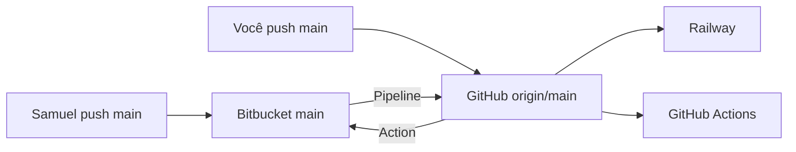

# Remotes Git — um repo lógico (GitHub ↔ Bitbucket)

Pair programming com **dois remotes espelhados automaticamente**. Samuel não
precisa ser colaborador no GitHub privado: ele publica no Bitbucket; o espelho
leva o tip ao GitHub e o Railway sobe.



| Remote | URL | Quem usa no dia a dia |
| --- | --- | --- |
| `origin` | `https://github.com/viniciuslnunes/botpde` | Você — CI, release, **Railway** |
| `bitbucket` | `https://bitbucket.org/setorize-torcidas/botpde.git` | Samuel — mesmo tip de `main` |

## Fluxo do pair (sem comando manual)

| Quem | Onde publica `main` | O que acontece |
| --- | --- | --- |
| Samuel | Bitbucket | Pipeline espelha → GitHub → Railway + Actions |
| Você | GitHub | Action espelha → Bitbucket (Samuel vê o tip) |

Anti-loop: se o destino já tem o mesmo SHA, o job sai 0 sem push.
Sem force-push: tip divergente falha e pede o fallback local.

Arquivos:

- [`bitbucket-pipelines.yml`](../../bitbucket-pipelines.yml) — Bitbucket → GitHub
- [`.github/workflows/mirror-bitbucket.yml`](../../.github/workflows/mirror-bitbucket.yml) — GitHub → Bitbucket

## Setup 1× (secrets)

### A) Bitbucket Pipelines → GitHub

1. No Bitbucket: **Repository settings → Pipelines → Settings** → Enable Pipelines.
2. Crie um **Fine-grained PAT** GitHub (sua conta):
   - [Fine-grained personal access tokens](https://github.com/settings/personal-access-tokens)
   - Resource owner: você · Repository access: só `viniciuslnunes/botpde`
   - Permissions: **Contents** Read and write · **Metadata** Read
3. Bitbucket → **Repository settings → Repository variables**:
   - Nome: `GITHUB_MIRROR_TOKEN`
   - Valor: o PAT
   - **Secured** = on

### B) GitHub Actions → Bitbucket

1. API token Atlassian com scopes Bitbucket:
   - [Create API token](https://id.atlassian.com/manage-profile/security/api-tokens)
   - App **Bitbucket**: `read:repository:bitbucket` + `write:repository:bitbucket`
2. GitHub → repo **Settings → Secrets and variables → Actions**:
   - Nome: `BITBUCKET_API_TOKEN`
   - Valor: o token (pode ser o mesmo do `.env.jira` local; **nunca** commitado)

### Smoke test

1. Push doc-only / commit vazio no **Bitbucket** `main` → Pipeline verde → tip no GitHub → Railway.
2. Push seu no **GitHub** `main` → workflow **Mirror → Bitbucket** verde → tip no Bitbucket.
3. O hop de volta deve ser no-op (“Already mirrored”).

## Fallback local (só emergência / divergência)

```bash
pnpm sync:bitbucket -- --dry-run
pnpm sync:bitbucket
```

Une tips e empurra nos dois remotes (ff / merge, sem force). Auth local:
`BITBUCKET_API_TOKEN` no `.env.jira` — ver também [`jira.env.example`](jira.env.example).

```bash
git remote add bitbucket https://bitbucket.org/setorize-torcidas/botpde.git
# ou:
git remote set-url bitbucket https://bitbucket.org/setorize-torcidas/botpde.git
```

## Por que Samuel não usa o GitHub

Repo privado sem colaborador para o par. O espelho **é** o acesso dele ao
mesmo histórico que o Railway vê. Não espere deploy a partir do Bitbucket
sozinho — o gatilho continua sendo o push espelhado no GitHub.

## Schema

Se o tip espelhado mudar `packages/db/prisma/schema.prisma`, seguir
[`schema-deploy.md`](schema-deploy.md).

## Jira (KAN)

[`jira-kan.md`](jira-kan.md) · commits `feat(scope): … (KAN-42)` ·
ScriptRunner [`jira-scriptrunner.md`](jira-scriptrunner.md).

## Ver remotes

```bash
git remote -v
```
